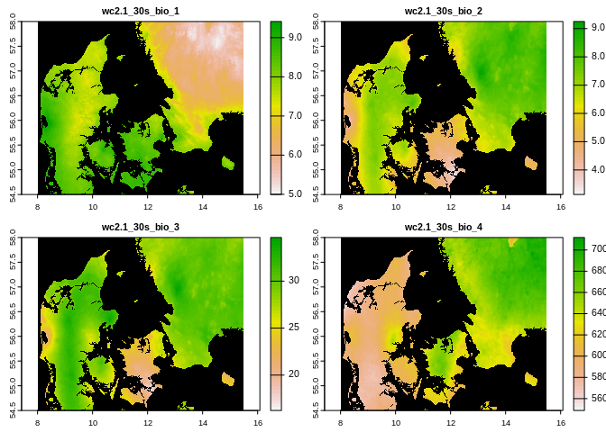
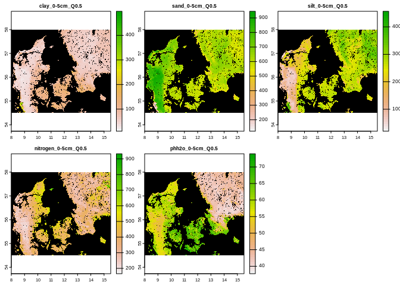
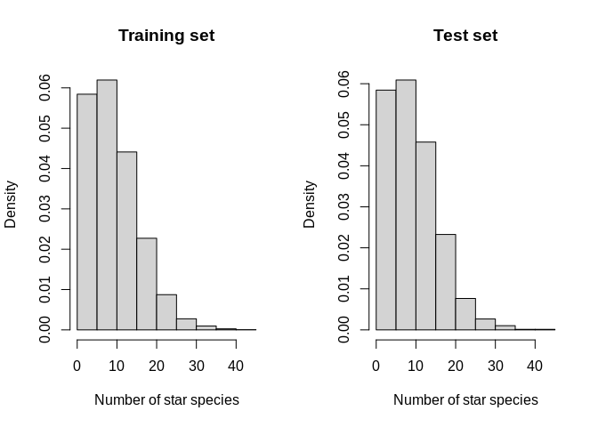
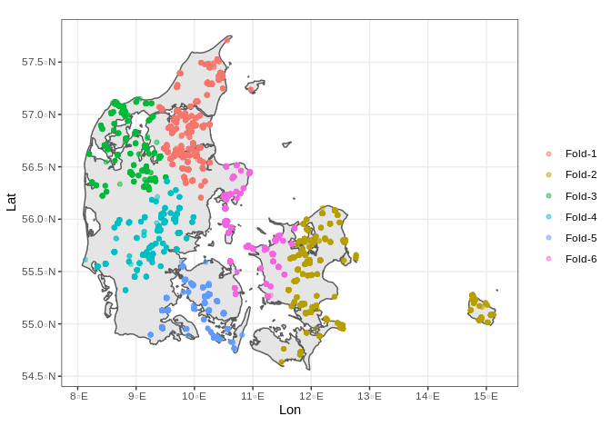

<!-- README.md is generated from README.Rmd. Please edit that file -->

# MachineLearningModelEnvironment

<!-- badges: start -->
<!-- badges: end -->

The goal of MachineLearningModelEnvironment is to use the Novana
Dataset, together with climatic and soil data in order to predict the
potential Species Richness, one star species richness and the Arstcore
for all of Denmark assuming that the whole country is tranformed into
one of the major habitats.

## Generation of the training dataset

In order to arrange this we will need the following packages:

``` r
library(tidyverse)
library(sf)
library(DT)
library(terra)
library(knitr)
library(geodata)
```

### Novana Dataset

First we will use points from the NOVANA dataset

``` r
Habs <- read_rds("AllData4.rds") %>%
  dplyr::filter(Dataset == "Novana") %>%
  separate(col = "ID", into = c("ID", "plot")) %>%
  dplyr::select("plot", "ID", "Dataset", "habtype", "MajorHab") %>%
  dplyr::filter(!is.na(MajorHab))
#> Warning: Expected 2 pieces. Additional pieces discarded in 1 rows [1].
```

There are 44532 plots, in the following table we can se the number of
plots per each type of habitat:

| MajorHab | number\_of\_plots |
|:---------|------------------:|
| 62       |              9460 |
| 21       |              9377 |
| 72       |              6604 |
| 40       |              5611 |
| 13       |              4313 |
| 71       |              3568 |
| 64       |              2868 |
| 23       |               895 |
| 91       |               397 |
| 22       |               297 |
| 99       |               289 |
| 51       |               236 |
| 61       |               187 |
| 12       |               185 |
| 82       |               183 |
| 11       |                25 |
| 31       |                21 |
| 70       |                15 |
| 32       |                 1 |

Number of plots per major habitat in descending order

And data for the 1, and 2 star species number and proportions, plus the
Artscore for all of them. In the Next table we can see how the first 20
observations look like:

``` r
Species <- read_csv("Novana/alledata-abiotiske2.csv") %>%
  dplyr::select("site", "plot", "year", "antalarter", "antalstjernearter", "antaltostjernearter",
    "antalenaarigearter", "meanscore", "andelstjerne", "andeltostjerne") %>%
  dplyr::filter(plot %in% Habs$plot) %>%
  mutate(plot = as.character(plot), site = as.character(site))
#> Warning: One or more parsing issues, see `problems()` for details
#> Rows: 97560 Columns: 97
#> ── Column specification ────────────────────────────────────────────────────────
#> Delimiter: ","
#> chr (76): sekhabtype, terhabtype, pHjord, pHvand, Cijord, Nijord, CNratio, F...
#> dbl (21): site, plot, year, UTMx, UTMy, fEL, fER, fEN, fAnnualsGrime, fchmax...
#> 
#> ℹ Use `spec()` to retrieve the full column specification for this data.
#> ℹ Specify the column types or set `show_col_types = FALSE` to quiet this message.


Habs <- Habs %>%
  left_join(Species)
#> Joining, by = "plot"

Habs <- Habs %>%
  drop_na() %>%
  st_transform(crs = 4326)
```

Since every plot can be measured multiple years we have more
observations than number of plots with 86485 observations.

| plot   | ID  | habtype | MajorHab | year | antalarter | antalstjernearter | antaltostjernearter | antalenaarigearter | meanscore | andelstjerne      | andeltostjerne    |
|:-------|:----|--------:|:---------|-----:|:-----------|:------------------|:--------------------|:-------------------|:----------|:------------------|:------------------|
| 488139 | 0   |    7230 | 72       | 2008 | 12         | 10                | 0                   | 0                  | 4         | 0.833333333333333 | 0                 |
| 488139 | 0   |    7230 | 72       | 2005 | 13         | 11                | 0                   | 0                  | 3.923076  | 0.846153846153846 | 0                 |
| 488139 | 0   |    7230 | 72       | 2006 | 16         | 12                | 1                   | 0                  | 3.875     | 0.75              | 0.0625            |
| 488139 | 0   |    7230 | 72       | 2007 | 15         | 9                 | 0                   | 0                  | 3.733333  | 0.6               | 0                 |
| 488139 | 0   |    7230 | 72       | 2008 | 12         | 10                | 0                   | 0                  | 4         | 0.833333333333333 | 0                 |
| 490840 | 0   |    7230 | 72       | 2009 | 28         | 12                | 1                   | 1                  | 3.285714  | 0.428571428571429 | 0.035714285714286 |
| 490840 | 0   |    7230 | 72       | 2004 | 39         | 16                | 4                   | 3                  | 3.25641   | 0.41025641025641  | 0.102564102564103 |
| 490840 | 0   |    7230 | 72       | 2005 | 39         | 15                | 1                   | 4                  | 3.025641  | 0.384615384615385 | 0.025641025641026 |
| 490840 | 0   |    7230 | 72       | 2006 | 41         | 17                | 0                   | 6                  | 3.170731  | 0.414634146341463 | 0                 |
| 490840 | 0   |    7230 | 72       | 2007 | 41         | 19                | 1                   | 3                  | 3.243902  | 0.463414634146341 | 0.024390243902439 |
| 490840 | 0   |    7230 | 72       | 2008 | 52         | 24                | 0                   | 3                  | 3.192307  | 0.461538461538462 | 0                 |
| 490840 | 0   |    7230 | 72       | 2009 | 28         | 12                | 1                   | 1                  | 3.285714  | 0.428571428571429 | 0.035714285714286 |
| 491679 | 0   |    2130 | 21       | 2008 | 12         | 7                 | 1                   | 2                  | 3.75      | 0.583333333333333 | 0.083333333333333 |
| 491679 | 0   |    2130 | 21       | 2004 | 12         | 6                 | 1                   | 4                  | 3.25      | 0.5               | 0.083333333333333 |
| 491679 | 0   |    2130 | 21       | 2005 | 10         | 4                 | 1                   | 2                  | 3.2       | 0.4               | 0.1               |
| 491679 | 0   |    2130 | 21       | 2006 | 8          | 4                 | 1                   | 1                  | 3.375     | 0.5               | 0.125             |
| 491679 | 0   |    2130 | 21       | 2007 | 9          | 3                 | 1                   | 0                  | 3.444444  | 0.333333333333333 | 0.111111111111111 |
| 491679 | 0   |    2130 | 21       | 2008 | 12         | 7                 | 1                   | 2                  | 3.75      | 0.583333333333333 | 0.083333333333333 |
| 491679 | 0   |    2130 | 21       | 2010 | 16         | 5                 | 1                   | 4                  | 3.1875    | 0.3125            | 0.0625            |
| 491679 | 0   |    2130 | 21       | 2011 | 15         | 6                 | 1                   | 3                  | 3.333333  | 0.4               | 0.066666666666667 |

## Predictor variables

### Climate data

First we download the Bioclimatic variables from worldclim for Denmark,
and extract the values for that in our points to add to the dataset:

``` r
Bio <- geodata::worldclim_country("Denmark", var = "bio", res = 0.5, path = getwd())


Habs <- Habs %>%
  bind_cols(terra::extract(Bio, vect(Habs))) %>%
  drop_na()
#> New names:
#> * ID -> ID...2
#> * ID -> ID...16
```

In the next graph we see the first 4 bioclimatic variables:

<!-- -->

### Soil data:

We will also use Clay, Sand, Silt, Nitrogen, and pH values from
Soildgrids,

``` r
Clay <- geodata::soil_world_vsi(var = "clay", stat = "Q0.5", depth = 5) %>%
  terra::resample(Bio[[1]])

Sand <- geodata::soil_world_vsi(var = "sand", stat = "Q0.5", depth = 5) %>%
  terra::resample(Bio[[1]])

Silt <- geodata::soil_world_vsi(var = "silt", stat = "Q0.5", depth = 5) %>%
  terra::resample(Bio[[1]])

Nitro <- geodata::soil_world_vsi(var = "nitrogen", stat = "Q0.5", depth = 5) %>%
  terra::resample(Bio[[1]])

pH <- geodata::soil_world_vsi(var = "phh2o", stat = "Q0.5", depth = 5) %>%
  terra::resample(Bio[[1]])


Soils <- c(Clay, Sand, Silt, Nitro, pH)

Habs <- Habs %>%
  bind_cols(terra::extract(Soils, vect(Habs))) %>%
  drop_na()
#> New names:
#> * ID...16 -> ID...15
#> * ID -> ID...36
```

Here we see the layers

``` r
plot(Soils, colNA = "black")
```

<!-- -->

After eliminating areas where the predictors are NA we finally have
70208 observations. In the following table we se the number of
observations per major habitat type

| MajorHab | number\_of\_plots |
|:---------|------------------:|
| 62       |             14609 |
| 21       |             12532 |
| 72       |             11354 |
| 40       |             11197 |
| 71       |              7838 |
| 64       |              4915 |
| 13       |              4493 |
| 23       |               900 |
| 91       |               648 |
| 99       |               542 |
| 22       |               520 |
| 51       |               216 |
| 82       |               174 |
| 61       |               147 |
| 12       |                57 |
| 11       |                25 |
| 31       |                25 |
| 70       |                15 |
| 32       |                 1 |

Number of observations per major habitat in descending order

``` r
Habs <- Habs %>%
  dplyr::select("plot", "site", "MajorHab", "year", "antalarter", "antalstjernearter",
    "antaltostjernearter", "antalenaarigearter", "meanscore", "andelstjerne",
    "andeltostjerne", "wc2.1_30s_bio_1", "wc2.1_30s_bio_2", "wc2.1_30s_bio_3",
    "wc2.1_30s_bio_4", "wc2.1_30s_bio_5", "wc2.1_30s_bio_6", "wc2.1_30s_bio_7",
    "wc2.1_30s_bio_8", "wc2.1_30s_bio_9", "wc2.1_30s_bio_10", "wc2.1_30s_bio_11",
    "wc2.1_30s_bio_12", "wc2.1_30s_bio_13", "wc2.1_30s_bio_14", "wc2.1_30s_bio_15",
    "wc2.1_30s_bio_16", "wc2.1_30s_bio_17", "wc2.1_30s_bio_18", "wc2.1_30s_bio_19",
    "clay_0-5cm_Q0.5", "sand_0-5cm_Q0.5", "silt_0-5cm_Q0.5", "nitrogen_0-5cm_Q0.5",
    "phh2o_0-5cm_Q0.5", "geometry")

Cols <- Habs %>%
  colnames() %>%
  str_remove_all("wc2.1_30s_|_0-5cm_Q0.5")

colnames(Habs) <- Cols

Habs <- saveRDS(Habs, "Predictors.rds")
```

# Modeling

In order to model we will use the `tidymodels` package

``` r
library(tidymodels)
#> Registered S3 method overwritten by 'tune':
#>   method                   from   
#>   required_pkgs.model_spec parsnip
#> ── Attaching packages ────────────────────────────────────── tidymodels 0.1.4 ──
#> ✓ broom        0.7.11     ✓ rsample      0.1.1 
#> ✓ dials        0.0.10     ✓ tune         0.1.6 
#> ✓ infer        1.0.0      ✓ workflows    0.2.4 
#> ✓ modeldata    0.1.1      ✓ workflowsets 0.1.0 
#> ✓ parsnip      0.1.7      ✓ yardstick    0.0.9 
#> ✓ recipes      0.1.17
#> ── Conflicts ───────────────────────────────────────── tidymodels_conflicts() ──
#> x terra::arrow()    masks ggplot2::arrow()
#> x scales::discard() masks purrr::discard()
#> x terra::extract()  masks tidyr::extract()
#> x dplyr::filter()   masks stats::filter()
#> x recipes::fixed()  masks stringr::fixed()
#> x dplyr::lag()      masks stats::lag()
#> x yardstick::spec() masks readr::spec()
#> x terra::src()      masks dplyr::src()
#> x recipes::step()   masks stats::step()
#> • Use tidymodels_prefer() to resolve common conflicts.
library(spatialsample)

Habs <- readRDS("Predictors.rds")

Coords <- st_coordinates(Habs) %>%
  as.data.frame() %>%
  set_names(c("Lon", "Lat"))

Habs <- Habs %>%
  bind_cols(Coords)
```

## Lets start building a model for the habitat with the largest datastet

For that we will filter for habitat type 62

``` r
Hab_62 <- Habs %>%
  dplyr::filter(MajorHab == 62) %>%
  mutate_at(c("antalarter", "antalstjernearter", "antaltostjernearter"), as.numeric) %>%
  drop_na()
#> Warning in mask$eval_all_mutate(quo): NAs introduced by coercion

#> Warning in mask$eval_all_mutate(quo): NAs introduced by coercion

#> Warning in mask$eval_all_mutate(quo): NAs introduced by coercion
```

Now we will generate a spatially stratified partition using the
`spatialsample` package:

First we will divide on an initial training and testing set with 80% for
the training and 20% for the testing set

``` r
set.seed(2022)
Hab_62_split <- initial_split(Hab_62, prop = 0.8, strata = antalstjernearter)
Hab_62_train <- training(Hab_62_split)
Hab_62_test <- testing(Hab_62_split)
```

As we see the frequency of star species is quite similar in the training
and testing set

<!-- -->

``` r
set.seed(2022)
Folds <- spatial_clustering_cv(as.data.frame(Hab_62_train), coords = c(Lat, Lon),
  v = 6)
```

Which can be seen here:

<!-- -->

## Predicting the number of starspecies for the

``` r
tidymodels_prefer()

brt_model <- parsnip::boost_tree(mode = "regression", trees = 1000, min_n = tune(),
  tree_depth = tune(), learn_rate = tune(), loss_reduction = tune()) %>%
  set_engine("xgboost", objective = "reg:squarederror")

# grid specification
xgboost_params <- dials::parameters(min_n(), tree_depth(), learn_rate(), loss_reduction())

xgboost_grid <- dials::grid_max_entropy(xgboost_params, size = 60)


brt_wflow <- workflow() %>%
  add_model(brt_model) %>%
  add_formula(antaltostjernearter ~ bio_1 + bio_2 + bio_3 + bio_4 + bio_5 + bio_6 +
    bio_7 + bio_8 + bio_9 + bio_10 + bio_11 + bio_12 + bio_13 + bio_14 + bio_15 +
    bio_16 + bio_17 + bio_18 + bio_19 + clay + sand + silt + nitrogen + phh2o +
    Lon + Lat)

# hyperparameter tuning
xgboost_tuned <- tune::tune_grid(object = brt_wflow, resamples = Folds, grid = xgboost_grid,
  metrics = yardstick::metric_set(rmse, rsq, mae), control = tune::control_grid(verbose = TRUE))
#> i Fold1: preprocessor 1/1
#> ✓ Fold1: preprocessor 1/1
#> i Fold1: preprocessor 1/1, model 1/60
#> ✓ Fold1: preprocessor 1/1, model 1/60
#> i Fold1: preprocessor 1/1, model 1/60 (predictions)
#> i Fold1: preprocessor 1/1, model 2/60
#> ✓ Fold1: preprocessor 1/1, model 2/60
#> i Fold1: preprocessor 1/1, model 2/60 (predictions)
#> i Fold1: preprocessor 1/1, model 3/60
#> ✓ Fold1: preprocessor 1/1, model 3/60
#> i Fold1: preprocessor 1/1, model 3/60 (predictions)
#> i Fold1: preprocessor 1/1, model 4/60
#> ✓ Fold1: preprocessor 1/1, model 4/60
#> i Fold1: preprocessor 1/1, model 4/60 (predictions)
#> i Fold1: preprocessor 1/1, model 5/60
#> ✓ Fold1: preprocessor 1/1, model 5/60
#> i Fold1: preprocessor 1/1, model 5/60 (predictions)
#> i Fold1: preprocessor 1/1, model 6/60
#> ✓ Fold1: preprocessor 1/1, model 6/60
#> i Fold1: preprocessor 1/1, model 6/60 (predictions)
#> i Fold1: preprocessor 1/1, model 7/60
#> ✓ Fold1: preprocessor 1/1, model 7/60
#> i Fold1: preprocessor 1/1, model 7/60 (predictions)
#> i Fold1: preprocessor 1/1, model 8/60
#> ✓ Fold1: preprocessor 1/1, model 8/60
#> i Fold1: preprocessor 1/1, model 8/60 (predictions)
#> i Fold1: preprocessor 1/1, model 9/60
#> ✓ Fold1: preprocessor 1/1, model 9/60
#> i Fold1: preprocessor 1/1, model 9/60 (predictions)
#> i Fold1: preprocessor 1/1, model 10/60
#> ✓ Fold1: preprocessor 1/1, model 10/60
#> i Fold1: preprocessor 1/1, model 10/60 (predictions)
#> i Fold1: preprocessor 1/1, model 11/60
#> ✓ Fold1: preprocessor 1/1, model 11/60
#> i Fold1: preprocessor 1/1, model 11/60 (predictions)
#> i Fold1: preprocessor 1/1, model 12/60
#> ✓ Fold1: preprocessor 1/1, model 12/60
#> i Fold1: preprocessor 1/1, model 12/60 (predictions)
#> i Fold1: preprocessor 1/1, model 13/60
#> ✓ Fold1: preprocessor 1/1, model 13/60
#> i Fold1: preprocessor 1/1, model 13/60 (predictions)
#> i Fold1: preprocessor 1/1, model 14/60
#> ✓ Fold1: preprocessor 1/1, model 14/60
#> i Fold1: preprocessor 1/1, model 14/60 (predictions)
#> i Fold1: preprocessor 1/1, model 15/60
#> ✓ Fold1: preprocessor 1/1, model 15/60
#> i Fold1: preprocessor 1/1, model 15/60 (predictions)
#> i Fold1: preprocessor 1/1, model 16/60
#> ✓ Fold1: preprocessor 1/1, model 16/60
#> i Fold1: preprocessor 1/1, model 16/60 (predictions)
#> i Fold1: preprocessor 1/1, model 17/60
#> ✓ Fold1: preprocessor 1/1, model 17/60
#> i Fold1: preprocessor 1/1, model 17/60 (predictions)
#> i Fold1: preprocessor 1/1, model 18/60
#> ✓ Fold1: preprocessor 1/1, model 18/60
#> i Fold1: preprocessor 1/1, model 18/60 (predictions)
#> i Fold1: preprocessor 1/1, model 19/60
#> ✓ Fold1: preprocessor 1/1, model 19/60
#> i Fold1: preprocessor 1/1, model 19/60 (predictions)
#> i Fold1: preprocessor 1/1, model 20/60
#> ✓ Fold1: preprocessor 1/1, model 20/60
#> i Fold1: preprocessor 1/1, model 20/60 (predictions)
#> i Fold1: preprocessor 1/1, model 21/60
#> ✓ Fold1: preprocessor 1/1, model 21/60
#> i Fold1: preprocessor 1/1, model 21/60 (predictions)
#> i Fold1: preprocessor 1/1, model 22/60
#> ✓ Fold1: preprocessor 1/1, model 22/60
#> i Fold1: preprocessor 1/1, model 22/60 (predictions)
#> i Fold1: preprocessor 1/1, model 23/60
#> ✓ Fold1: preprocessor 1/1, model 23/60
#> i Fold1: preprocessor 1/1, model 23/60 (predictions)
#> i Fold1: preprocessor 1/1, model 24/60
#> ✓ Fold1: preprocessor 1/1, model 24/60
#> i Fold1: preprocessor 1/1, model 24/60 (predictions)
#> i Fold1: preprocessor 1/1, model 25/60
#> ✓ Fold1: preprocessor 1/1, model 25/60
#> i Fold1: preprocessor 1/1, model 25/60 (predictions)
#> i Fold1: preprocessor 1/1, model 26/60
#> ✓ Fold1: preprocessor 1/1, model 26/60
#> i Fold1: preprocessor 1/1, model 26/60 (predictions)
#> i Fold1: preprocessor 1/1, model 27/60
#> ✓ Fold1: preprocessor 1/1, model 27/60
#> i Fold1: preprocessor 1/1, model 27/60 (predictions)
#> i Fold1: preprocessor 1/1, model 28/60
#> ✓ Fold1: preprocessor 1/1, model 28/60
#> i Fold1: preprocessor 1/1, model 28/60 (predictions)
#> i Fold1: preprocessor 1/1, model 29/60
#> ✓ Fold1: preprocessor 1/1, model 29/60
#> i Fold1: preprocessor 1/1, model 29/60 (predictions)
#> i Fold1: preprocessor 1/1, model 30/60
#> ✓ Fold1: preprocessor 1/1, model 30/60
#> i Fold1: preprocessor 1/1, model 30/60 (predictions)
#> i Fold1: preprocessor 1/1, model 31/60
#> ✓ Fold1: preprocessor 1/1, model 31/60
#> i Fold1: preprocessor 1/1, model 31/60 (predictions)
#> i Fold1: preprocessor 1/1, model 32/60
#> ✓ Fold1: preprocessor 1/1, model 32/60
#> i Fold1: preprocessor 1/1, model 32/60 (predictions)
#> i Fold1: preprocessor 1/1, model 33/60
#> ✓ Fold1: preprocessor 1/1, model 33/60
#> i Fold1: preprocessor 1/1, model 33/60 (predictions)
#> i Fold1: preprocessor 1/1, model 34/60
#> ✓ Fold1: preprocessor 1/1, model 34/60
#> i Fold1: preprocessor 1/1, model 34/60 (predictions)
#> i Fold1: preprocessor 1/1, model 35/60
#> ✓ Fold1: preprocessor 1/1, model 35/60
#> i Fold1: preprocessor 1/1, model 35/60 (predictions)
#> i Fold1: preprocessor 1/1, model 36/60
#> ✓ Fold1: preprocessor 1/1, model 36/60
#> i Fold1: preprocessor 1/1, model 36/60 (predictions)
#> i Fold1: preprocessor 1/1, model 37/60
#> ✓ Fold1: preprocessor 1/1, model 37/60
#> i Fold1: preprocessor 1/1, model 37/60 (predictions)
#> i Fold1: preprocessor 1/1, model 38/60
#> ✓ Fold1: preprocessor 1/1, model 38/60
#> i Fold1: preprocessor 1/1, model 38/60 (predictions)
#> i Fold1: preprocessor 1/1, model 39/60
#> ✓ Fold1: preprocessor 1/1, model 39/60
#> i Fold1: preprocessor 1/1, model 39/60 (predictions)
#> i Fold1: preprocessor 1/1, model 40/60
#> ✓ Fold1: preprocessor 1/1, model 40/60
#> i Fold1: preprocessor 1/1, model 40/60 (predictions)
#> i Fold1: preprocessor 1/1, model 41/60
#> ✓ Fold1: preprocessor 1/1, model 41/60
#> i Fold1: preprocessor 1/1, model 41/60 (predictions)
#> i Fold1: preprocessor 1/1, model 42/60
#> ✓ Fold1: preprocessor 1/1, model 42/60
#> i Fold1: preprocessor 1/1, model 42/60 (predictions)
#> i Fold1: preprocessor 1/1, model 43/60
#> ✓ Fold1: preprocessor 1/1, model 43/60
#> i Fold1: preprocessor 1/1, model 43/60 (predictions)
#> i Fold1: preprocessor 1/1, model 44/60
#> ✓ Fold1: preprocessor 1/1, model 44/60
#> i Fold1: preprocessor 1/1, model 44/60 (predictions)
#> i Fold1: preprocessor 1/1, model 45/60
#> ✓ Fold1: preprocessor 1/1, model 45/60
#> i Fold1: preprocessor 1/1, model 45/60 (predictions)
#> i Fold1: preprocessor 1/1, model 46/60
#> ✓ Fold1: preprocessor 1/1, model 46/60
#> i Fold1: preprocessor 1/1, model 46/60 (predictions)
#> i Fold1: preprocessor 1/1, model 47/60
#> ✓ Fold1: preprocessor 1/1, model 47/60
#> i Fold1: preprocessor 1/1, model 47/60 (predictions)
#> i Fold1: preprocessor 1/1, model 48/60
#> ✓ Fold1: preprocessor 1/1, model 48/60
#> i Fold1: preprocessor 1/1, model 48/60 (predictions)
#> i Fold1: preprocessor 1/1, model 49/60
#> ✓ Fold1: preprocessor 1/1, model 49/60
#> i Fold1: preprocessor 1/1, model 49/60 (predictions)
#> i Fold1: preprocessor 1/1, model 50/60
#> ✓ Fold1: preprocessor 1/1, model 50/60
#> i Fold1: preprocessor 1/1, model 50/60 (predictions)
#> i Fold1: preprocessor 1/1, model 51/60
#> ✓ Fold1: preprocessor 1/1, model 51/60
#> i Fold1: preprocessor 1/1, model 51/60 (predictions)
#> i Fold1: preprocessor 1/1, model 52/60
#> ✓ Fold1: preprocessor 1/1, model 52/60
#> i Fold1: preprocessor 1/1, model 52/60 (predictions)
#> i Fold1: preprocessor 1/1, model 53/60
#> ✓ Fold1: preprocessor 1/1, model 53/60
#> i Fold1: preprocessor 1/1, model 53/60 (predictions)
#> i Fold1: preprocessor 1/1, model 54/60
#> ✓ Fold1: preprocessor 1/1, model 54/60
#> i Fold1: preprocessor 1/1, model 54/60 (predictions)
#> i Fold1: preprocessor 1/1, model 55/60
#> ✓ Fold1: preprocessor 1/1, model 55/60
#> i Fold1: preprocessor 1/1, model 55/60 (predictions)
#> i Fold1: preprocessor 1/1, model 56/60
#> ✓ Fold1: preprocessor 1/1, model 56/60
#> i Fold1: preprocessor 1/1, model 56/60 (predictions)
#> i Fold1: preprocessor 1/1, model 57/60
#> ✓ Fold1: preprocessor 1/1, model 57/60
#> i Fold1: preprocessor 1/1, model 57/60 (predictions)
#> i Fold1: preprocessor 1/1, model 58/60
#> ✓ Fold1: preprocessor 1/1, model 58/60
#> i Fold1: preprocessor 1/1, model 58/60 (predictions)
#> i Fold1: preprocessor 1/1, model 59/60
#> ✓ Fold1: preprocessor 1/1, model 59/60
#> i Fold1: preprocessor 1/1, model 59/60 (predictions)
#> i Fold1: preprocessor 1/1, model 60/60
#> ✓ Fold1: preprocessor 1/1, model 60/60
#> i Fold1: preprocessor 1/1, model 60/60 (predictions)
#> ! Fold1: internal: A correlation computation is required, but `estimate` is const...
#> ✓ Fold1: internal
#> i Fold2: preprocessor 1/1
#> ✓ Fold2: preprocessor 1/1
#> i Fold2: preprocessor 1/1, model 1/60
#> ✓ Fold2: preprocessor 1/1, model 1/60
#> i Fold2: preprocessor 1/1, model 1/60 (predictions)
#> i Fold2: preprocessor 1/1, model 2/60
#> ✓ Fold2: preprocessor 1/1, model 2/60
#> i Fold2: preprocessor 1/1, model 2/60 (predictions)
#> i Fold2: preprocessor 1/1, model 3/60
#> ✓ Fold2: preprocessor 1/1, model 3/60
#> i Fold2: preprocessor 1/1, model 3/60 (predictions)
#> i Fold2: preprocessor 1/1, model 4/60
#> ✓ Fold2: preprocessor 1/1, model 4/60
#> i Fold2: preprocessor 1/1, model 4/60 (predictions)
#> i Fold2: preprocessor 1/1, model 5/60
#> ✓ Fold2: preprocessor 1/1, model 5/60
#> i Fold2: preprocessor 1/1, model 5/60 (predictions)
#> i Fold2: preprocessor 1/1, model 6/60
#> ✓ Fold2: preprocessor 1/1, model 6/60
#> i Fold2: preprocessor 1/1, model 6/60 (predictions)
#> i Fold2: preprocessor 1/1, model 7/60
#> ✓ Fold2: preprocessor 1/1, model 7/60
#> i Fold2: preprocessor 1/1, model 7/60 (predictions)
#> i Fold2: preprocessor 1/1, model 8/60
#> ✓ Fold2: preprocessor 1/1, model 8/60
#> i Fold2: preprocessor 1/1, model 8/60 (predictions)
#> i Fold2: preprocessor 1/1, model 9/60
#> ✓ Fold2: preprocessor 1/1, model 9/60
#> i Fold2: preprocessor 1/1, model 9/60 (predictions)
#> i Fold2: preprocessor 1/1, model 10/60
#> ✓ Fold2: preprocessor 1/1, model 10/60
#> i Fold2: preprocessor 1/1, model 10/60 (predictions)
#> i Fold2: preprocessor 1/1, model 11/60
#> ✓ Fold2: preprocessor 1/1, model 11/60
#> i Fold2: preprocessor 1/1, model 11/60 (predictions)
#> i Fold2: preprocessor 1/1, model 12/60
#> ✓ Fold2: preprocessor 1/1, model 12/60
#> i Fold2: preprocessor 1/1, model 12/60 (predictions)
#> i Fold2: preprocessor 1/1, model 13/60
#> ✓ Fold2: preprocessor 1/1, model 13/60
#> i Fold2: preprocessor 1/1, model 13/60 (predictions)
#> i Fold2: preprocessor 1/1, model 14/60
#> ✓ Fold2: preprocessor 1/1, model 14/60
#> i Fold2: preprocessor 1/1, model 14/60 (predictions)
#> i Fold2: preprocessor 1/1, model 15/60
#> ✓ Fold2: preprocessor 1/1, model 15/60
#> i Fold2: preprocessor 1/1, model 15/60 (predictions)
#> i Fold2: preprocessor 1/1, model 16/60
#> ✓ Fold2: preprocessor 1/1, model 16/60
#> i Fold2: preprocessor 1/1, model 16/60 (predictions)
#> i Fold2: preprocessor 1/1, model 17/60
#> ✓ Fold2: preprocessor 1/1, model 17/60
#> i Fold2: preprocessor 1/1, model 17/60 (predictions)
#> i Fold2: preprocessor 1/1, model 18/60
#> ✓ Fold2: preprocessor 1/1, model 18/60
#> i Fold2: preprocessor 1/1, model 18/60 (predictions)
#> i Fold2: preprocessor 1/1, model 19/60
#> ✓ Fold2: preprocessor 1/1, model 19/60
#> i Fold2: preprocessor 1/1, model 19/60 (predictions)
#> i Fold2: preprocessor 1/1, model 20/60
#> ✓ Fold2: preprocessor 1/1, model 20/60
#> i Fold2: preprocessor 1/1, model 20/60 (predictions)
#> i Fold2: preprocessor 1/1, model 21/60
#> ✓ Fold2: preprocessor 1/1, model 21/60
#> i Fold2: preprocessor 1/1, model 21/60 (predictions)
#> i Fold2: preprocessor 1/1, model 22/60
#> ✓ Fold2: preprocessor 1/1, model 22/60
#> i Fold2: preprocessor 1/1, model 22/60 (predictions)
#> i Fold2: preprocessor 1/1, model 23/60
#> ✓ Fold2: preprocessor 1/1, model 23/60
#> i Fold2: preprocessor 1/1, model 23/60 (predictions)
#> i Fold2: preprocessor 1/1, model 24/60
#> ✓ Fold2: preprocessor 1/1, model 24/60
#> i Fold2: preprocessor 1/1, model 24/60 (predictions)
#> i Fold2: preprocessor 1/1, model 25/60
#> ✓ Fold2: preprocessor 1/1, model 25/60
#> i Fold2: preprocessor 1/1, model 25/60 (predictions)
#> i Fold2: preprocessor 1/1, model 26/60
#> ✓ Fold2: preprocessor 1/1, model 26/60
#> i Fold2: preprocessor 1/1, model 26/60 (predictions)
#> i Fold2: preprocessor 1/1, model 27/60
#> ✓ Fold2: preprocessor 1/1, model 27/60
#> i Fold2: preprocessor 1/1, model 27/60 (predictions)
#> i Fold2: preprocessor 1/1, model 28/60
#> ✓ Fold2: preprocessor 1/1, model 28/60
#> i Fold2: preprocessor 1/1, model 28/60 (predictions)
#> i Fold2: preprocessor 1/1, model 29/60
#> ✓ Fold2: preprocessor 1/1, model 29/60
#> i Fold2: preprocessor 1/1, model 29/60 (predictions)
#> i Fold2: preprocessor 1/1, model 30/60
#> ✓ Fold2: preprocessor 1/1, model 30/60
#> i Fold2: preprocessor 1/1, model 30/60 (predictions)
#> i Fold2: preprocessor 1/1, model 31/60
#> ✓ Fold2: preprocessor 1/1, model 31/60
#> i Fold2: preprocessor 1/1, model 31/60 (predictions)
#> i Fold2: preprocessor 1/1, model 32/60
#> ✓ Fold2: preprocessor 1/1, model 32/60
#> i Fold2: preprocessor 1/1, model 32/60 (predictions)
#> i Fold2: preprocessor 1/1, model 33/60
#> ✓ Fold2: preprocessor 1/1, model 33/60
#> i Fold2: preprocessor 1/1, model 33/60 (predictions)
#> i Fold2: preprocessor 1/1, model 34/60
#> ✓ Fold2: preprocessor 1/1, model 34/60
#> i Fold2: preprocessor 1/1, model 34/60 (predictions)
#> i Fold2: preprocessor 1/1, model 35/60
#> ✓ Fold2: preprocessor 1/1, model 35/60
#> i Fold2: preprocessor 1/1, model 35/60 (predictions)
#> i Fold2: preprocessor 1/1, model 36/60
#> ✓ Fold2: preprocessor 1/1, model 36/60
#> i Fold2: preprocessor 1/1, model 36/60 (predictions)
#> i Fold2: preprocessor 1/1, model 37/60
#> ✓ Fold2: preprocessor 1/1, model 37/60
#> i Fold2: preprocessor 1/1, model 37/60 (predictions)
#> i Fold2: preprocessor 1/1, model 38/60
#> ✓ Fold2: preprocessor 1/1, model 38/60
#> i Fold2: preprocessor 1/1, model 38/60 (predictions)
#> i Fold2: preprocessor 1/1, model 39/60
#> ✓ Fold2: preprocessor 1/1, model 39/60
#> i Fold2: preprocessor 1/1, model 39/60 (predictions)
#> i Fold2: preprocessor 1/1, model 40/60
#> ✓ Fold2: preprocessor 1/1, model 40/60
#> i Fold2: preprocessor 1/1, model 40/60 (predictions)
#> i Fold2: preprocessor 1/1, model 41/60
#> ✓ Fold2: preprocessor 1/1, model 41/60
#> i Fold2: preprocessor 1/1, model 41/60 (predictions)
#> i Fold2: preprocessor 1/1, model 42/60
#> ✓ Fold2: preprocessor 1/1, model 42/60
#> i Fold2: preprocessor 1/1, model 42/60 (predictions)
#> i Fold2: preprocessor 1/1, model 43/60
#> ✓ Fold2: preprocessor 1/1, model 43/60
#> i Fold2: preprocessor 1/1, model 43/60 (predictions)
#> i Fold2: preprocessor 1/1, model 44/60
#> ✓ Fold2: preprocessor 1/1, model 44/60
#> i Fold2: preprocessor 1/1, model 44/60 (predictions)
#> i Fold2: preprocessor 1/1, model 45/60
#> ✓ Fold2: preprocessor 1/1, model 45/60
#> i Fold2: preprocessor 1/1, model 45/60 (predictions)
#> i Fold2: preprocessor 1/1, model 46/60
#> ✓ Fold2: preprocessor 1/1, model 46/60
#> i Fold2: preprocessor 1/1, model 46/60 (predictions)
#> i Fold2: preprocessor 1/1, model 47/60
#> ✓ Fold2: preprocessor 1/1, model 47/60
#> i Fold2: preprocessor 1/1, model 47/60 (predictions)
#> i Fold2: preprocessor 1/1, model 48/60
#> ✓ Fold2: preprocessor 1/1, model 48/60
#> i Fold2: preprocessor 1/1, model 48/60 (predictions)
#> i Fold2: preprocessor 1/1, model 49/60
#> ✓ Fold2: preprocessor 1/1, model 49/60
#> i Fold2: preprocessor 1/1, model 49/60 (predictions)
#> i Fold2: preprocessor 1/1, model 50/60
#> ✓ Fold2: preprocessor 1/1, model 50/60
#> i Fold2: preprocessor 1/1, model 50/60 (predictions)
#> i Fold2: preprocessor 1/1, model 51/60
#> ✓ Fold2: preprocessor 1/1, model 51/60
#> i Fold2: preprocessor 1/1, model 51/60 (predictions)
#> i Fold2: preprocessor 1/1, model 52/60
#> ✓ Fold2: preprocessor 1/1, model 52/60
#> i Fold2: preprocessor 1/1, model 52/60 (predictions)
#> i Fold2: preprocessor 1/1, model 53/60
#> ✓ Fold2: preprocessor 1/1, model 53/60
#> i Fold2: preprocessor 1/1, model 53/60 (predictions)
#> i Fold2: preprocessor 1/1, model 54/60
#> ✓ Fold2: preprocessor 1/1, model 54/60
#> i Fold2: preprocessor 1/1, model 54/60 (predictions)
#> i Fold2: preprocessor 1/1, model 55/60
#> ✓ Fold2: preprocessor 1/1, model 55/60
#> i Fold2: preprocessor 1/1, model 55/60 (predictions)
#> i Fold2: preprocessor 1/1, model 56/60
#> ✓ Fold2: preprocessor 1/1, model 56/60
#> i Fold2: preprocessor 1/1, model 56/60 (predictions)
#> i Fold2: preprocessor 1/1, model 57/60
#> ✓ Fold2: preprocessor 1/1, model 57/60
#> i Fold2: preprocessor 1/1, model 57/60 (predictions)
#> i Fold2: preprocessor 1/1, model 58/60
#> ✓ Fold2: preprocessor 1/1, model 58/60
#> i Fold2: preprocessor 1/1, model 58/60 (predictions)
#> i Fold2: preprocessor 1/1, model 59/60
#> ✓ Fold2: preprocessor 1/1, model 59/60
#> i Fold2: preprocessor 1/1, model 59/60 (predictions)
#> i Fold2: preprocessor 1/1, model 60/60
#> ✓ Fold2: preprocessor 1/1, model 60/60
#> i Fold2: preprocessor 1/1, model 60/60 (predictions)
#> ! Fold2: internal: A correlation computation is required, but `estimate` is const...
#> ✓ Fold2: internal
#> i Fold3: preprocessor 1/1
#> ✓ Fold3: preprocessor 1/1
#> i Fold3: preprocessor 1/1, model 1/60
#> ✓ Fold3: preprocessor 1/1, model 1/60
#> i Fold3: preprocessor 1/1, model 1/60 (predictions)
#> i Fold3: preprocessor 1/1, model 2/60
#> ✓ Fold3: preprocessor 1/1, model 2/60
#> i Fold3: preprocessor 1/1, model 2/60 (predictions)
#> i Fold3: preprocessor 1/1, model 3/60
#> ✓ Fold3: preprocessor 1/1, model 3/60
#> i Fold3: preprocessor 1/1, model 3/60 (predictions)
#> i Fold3: preprocessor 1/1, model 4/60
#> ✓ Fold3: preprocessor 1/1, model 4/60
#> i Fold3: preprocessor 1/1, model 4/60 (predictions)
#> i Fold3: preprocessor 1/1, model 5/60
#> ✓ Fold3: preprocessor 1/1, model 5/60
#> i Fold3: preprocessor 1/1, model 5/60 (predictions)
#> i Fold3: preprocessor 1/1, model 6/60
#> ✓ Fold3: preprocessor 1/1, model 6/60
#> i Fold3: preprocessor 1/1, model 6/60 (predictions)
#> i Fold3: preprocessor 1/1, model 7/60
#> ✓ Fold3: preprocessor 1/1, model 7/60
#> i Fold3: preprocessor 1/1, model 7/60 (predictions)
#> i Fold3: preprocessor 1/1, model 8/60
#> ✓ Fold3: preprocessor 1/1, model 8/60
#> i Fold3: preprocessor 1/1, model 8/60 (predictions)
#> i Fold3: preprocessor 1/1, model 9/60
#> ✓ Fold3: preprocessor 1/1, model 9/60
#> i Fold3: preprocessor 1/1, model 9/60 (predictions)
#> i Fold3: preprocessor 1/1, model 10/60
#> ✓ Fold3: preprocessor 1/1, model 10/60
#> i Fold3: preprocessor 1/1, model 10/60 (predictions)
#> i Fold3: preprocessor 1/1, model 11/60
#> ✓ Fold3: preprocessor 1/1, model 11/60
#> i Fold3: preprocessor 1/1, model 11/60 (predictions)
#> i Fold3: preprocessor 1/1, model 12/60
#> ✓ Fold3: preprocessor 1/1, model 12/60
#> i Fold3: preprocessor 1/1, model 12/60 (predictions)
#> i Fold3: preprocessor 1/1, model 13/60
#> ✓ Fold3: preprocessor 1/1, model 13/60
#> i Fold3: preprocessor 1/1, model 13/60 (predictions)
#> i Fold3: preprocessor 1/1, model 14/60
#> ✓ Fold3: preprocessor 1/1, model 14/60
#> i Fold3: preprocessor 1/1, model 14/60 (predictions)
#> i Fold3: preprocessor 1/1, model 15/60
#> ✓ Fold3: preprocessor 1/1, model 15/60
#> i Fold3: preprocessor 1/1, model 15/60 (predictions)
#> i Fold3: preprocessor 1/1, model 16/60
#> ✓ Fold3: preprocessor 1/1, model 16/60
#> i Fold3: preprocessor 1/1, model 16/60 (predictions)
#> i Fold3: preprocessor 1/1, model 17/60
#> ✓ Fold3: preprocessor 1/1, model 17/60
#> i Fold3: preprocessor 1/1, model 17/60 (predictions)
#> i Fold3: preprocessor 1/1, model 18/60
#> ✓ Fold3: preprocessor 1/1, model 18/60
#> i Fold3: preprocessor 1/1, model 18/60 (predictions)
#> i Fold3: preprocessor 1/1, model 19/60
#> ✓ Fold3: preprocessor 1/1, model 19/60
#> i Fold3: preprocessor 1/1, model 19/60 (predictions)
#> i Fold3: preprocessor 1/1, model 20/60
#> ✓ Fold3: preprocessor 1/1, model 20/60
#> i Fold3: preprocessor 1/1, model 20/60 (predictions)
#> i Fold3: preprocessor 1/1, model 21/60
#> ✓ Fold3: preprocessor 1/1, model 21/60
#> i Fold3: preprocessor 1/1, model 21/60 (predictions)
#> i Fold3: preprocessor 1/1, model 22/60
#> ✓ Fold3: preprocessor 1/1, model 22/60
#> i Fold3: preprocessor 1/1, model 22/60 (predictions)
#> i Fold3: preprocessor 1/1, model 23/60
#> ✓ Fold3: preprocessor 1/1, model 23/60
#> i Fold3: preprocessor 1/1, model 23/60 (predictions)
#> i Fold3: preprocessor 1/1, model 24/60
#> ✓ Fold3: preprocessor 1/1, model 24/60
#> i Fold3: preprocessor 1/1, model 24/60 (predictions)
#> i Fold3: preprocessor 1/1, model 25/60
#> ✓ Fold3: preprocessor 1/1, model 25/60
#> i Fold3: preprocessor 1/1, model 25/60 (predictions)
#> i Fold3: preprocessor 1/1, model 26/60
#> ✓ Fold3: preprocessor 1/1, model 26/60
#> i Fold3: preprocessor 1/1, model 26/60 (predictions)
#> i Fold3: preprocessor 1/1, model 27/60
#> ✓ Fold3: preprocessor 1/1, model 27/60
#> i Fold3: preprocessor 1/1, model 27/60 (predictions)
#> i Fold3: preprocessor 1/1, model 28/60
#> ✓ Fold3: preprocessor 1/1, model 28/60
#> i Fold3: preprocessor 1/1, model 28/60 (predictions)
#> i Fold3: preprocessor 1/1, model 29/60
#> ✓ Fold3: preprocessor 1/1, model 29/60
#> i Fold3: preprocessor 1/1, model 29/60 (predictions)
#> i Fold3: preprocessor 1/1, model 30/60
#> ✓ Fold3: preprocessor 1/1, model 30/60
#> i Fold3: preprocessor 1/1, model 30/60 (predictions)
#> i Fold3: preprocessor 1/1, model 31/60
#> ✓ Fold3: preprocessor 1/1, model 31/60
#> i Fold3: preprocessor 1/1, model 31/60 (predictions)
#> i Fold3: preprocessor 1/1, model 32/60
#> ✓ Fold3: preprocessor 1/1, model 32/60
#> i Fold3: preprocessor 1/1, model 32/60 (predictions)
#> i Fold3: preprocessor 1/1, model 33/60
#> ✓ Fold3: preprocessor 1/1, model 33/60
#> i Fold3: preprocessor 1/1, model 33/60 (predictions)
#> i Fold3: preprocessor 1/1, model 34/60
#> ✓ Fold3: preprocessor 1/1, model 34/60
#> i Fold3: preprocessor 1/1, model 34/60 (predictions)
#> i Fold3: preprocessor 1/1, model 35/60
#> ✓ Fold3: preprocessor 1/1, model 35/60
#> i Fold3: preprocessor 1/1, model 35/60 (predictions)
#> i Fold3: preprocessor 1/1, model 36/60
#> ✓ Fold3: preprocessor 1/1, model 36/60
#> i Fold3: preprocessor 1/1, model 36/60 (predictions)
#> i Fold3: preprocessor 1/1, model 37/60
#> ✓ Fold3: preprocessor 1/1, model 37/60
#> i Fold3: preprocessor 1/1, model 37/60 (predictions)
#> i Fold3: preprocessor 1/1, model 38/60
#> ✓ Fold3: preprocessor 1/1, model 38/60
#> i Fold3: preprocessor 1/1, model 38/60 (predictions)
#> i Fold3: preprocessor 1/1, model 39/60
#> ✓ Fold3: preprocessor 1/1, model 39/60
#> i Fold3: preprocessor 1/1, model 39/60 (predictions)
#> i Fold3: preprocessor 1/1, model 40/60
#> ✓ Fold3: preprocessor 1/1, model 40/60
#> i Fold3: preprocessor 1/1, model 40/60 (predictions)
#> i Fold3: preprocessor 1/1, model 41/60
#> ✓ Fold3: preprocessor 1/1, model 41/60
#> i Fold3: preprocessor 1/1, model 41/60 (predictions)
#> i Fold3: preprocessor 1/1, model 42/60
#> ✓ Fold3: preprocessor 1/1, model 42/60
#> i Fold3: preprocessor 1/1, model 42/60 (predictions)
#> i Fold3: preprocessor 1/1, model 43/60
#> ✓ Fold3: preprocessor 1/1, model 43/60
#> i Fold3: preprocessor 1/1, model 43/60 (predictions)
#> i Fold3: preprocessor 1/1, model 44/60
#> ✓ Fold3: preprocessor 1/1, model 44/60
#> i Fold3: preprocessor 1/1, model 44/60 (predictions)
#> i Fold3: preprocessor 1/1, model 45/60
#> ✓ Fold3: preprocessor 1/1, model 45/60
#> i Fold3: preprocessor 1/1, model 45/60 (predictions)
#> i Fold3: preprocessor 1/1, model 46/60
#> ✓ Fold3: preprocessor 1/1, model 46/60
#> i Fold3: preprocessor 1/1, model 46/60 (predictions)
#> i Fold3: preprocessor 1/1, model 47/60
#> ✓ Fold3: preprocessor 1/1, model 47/60
#> i Fold3: preprocessor 1/1, model 47/60 (predictions)
#> i Fold3: preprocessor 1/1, model 48/60
#> ✓ Fold3: preprocessor 1/1, model 48/60
#> i Fold3: preprocessor 1/1, model 48/60 (predictions)
#> i Fold3: preprocessor 1/1, model 49/60
#> ✓ Fold3: preprocessor 1/1, model 49/60
#> i Fold3: preprocessor 1/1, model 49/60 (predictions)
#> i Fold3: preprocessor 1/1, model 50/60
#> ✓ Fold3: preprocessor 1/1, model 50/60
#> i Fold3: preprocessor 1/1, model 50/60 (predictions)
#> i Fold3: preprocessor 1/1, model 51/60
#> ✓ Fold3: preprocessor 1/1, model 51/60
#> i Fold3: preprocessor 1/1, model 51/60 (predictions)
#> i Fold3: preprocessor 1/1, model 52/60
#> ✓ Fold3: preprocessor 1/1, model 52/60
#> i Fold3: preprocessor 1/1, model 52/60 (predictions)
#> i Fold3: preprocessor 1/1, model 53/60
#> ✓ Fold3: preprocessor 1/1, model 53/60
#> i Fold3: preprocessor 1/1, model 53/60 (predictions)
#> i Fold3: preprocessor 1/1, model 54/60
#> ✓ Fold3: preprocessor 1/1, model 54/60
#> i Fold3: preprocessor 1/1, model 54/60 (predictions)
#> i Fold3: preprocessor 1/1, model 55/60
#> ✓ Fold3: preprocessor 1/1, model 55/60
#> i Fold3: preprocessor 1/1, model 55/60 (predictions)
#> i Fold3: preprocessor 1/1, model 56/60
#> ✓ Fold3: preprocessor 1/1, model 56/60
#> i Fold3: preprocessor 1/1, model 56/60 (predictions)
#> i Fold3: preprocessor 1/1, model 57/60
#> ✓ Fold3: preprocessor 1/1, model 57/60
#> i Fold3: preprocessor 1/1, model 57/60 (predictions)
#> i Fold3: preprocessor 1/1, model 58/60
#> ✓ Fold3: preprocessor 1/1, model 58/60
#> i Fold3: preprocessor 1/1, model 58/60 (predictions)
#> i Fold3: preprocessor 1/1, model 59/60
#> ✓ Fold3: preprocessor 1/1, model 59/60
#> i Fold3: preprocessor 1/1, model 59/60 (predictions)
#> i Fold3: preprocessor 1/1, model 60/60
#> ✓ Fold3: preprocessor 1/1, model 60/60
#> i Fold3: preprocessor 1/1, model 60/60 (predictions)
#> ! Fold3: internal: A correlation computation is required, but `estimate` is const...
#> ✓ Fold3: internal
#> i Fold4: preprocessor 1/1
#> ✓ Fold4: preprocessor 1/1
#> i Fold4: preprocessor 1/1, model 1/60
#> ✓ Fold4: preprocessor 1/1, model 1/60
#> i Fold4: preprocessor 1/1, model 1/60 (predictions)
#> i Fold4: preprocessor 1/1, model 2/60
#> ✓ Fold4: preprocessor 1/1, model 2/60
#> i Fold4: preprocessor 1/1, model 2/60 (predictions)
#> i Fold4: preprocessor 1/1, model 3/60
#> ✓ Fold4: preprocessor 1/1, model 3/60
#> i Fold4: preprocessor 1/1, model 3/60 (predictions)
#> i Fold4: preprocessor 1/1, model 4/60
#> ✓ Fold4: preprocessor 1/1, model 4/60
#> i Fold4: preprocessor 1/1, model 4/60 (predictions)
#> i Fold4: preprocessor 1/1, model 5/60
#> ✓ Fold4: preprocessor 1/1, model 5/60
#> i Fold4: preprocessor 1/1, model 5/60 (predictions)
#> i Fold4: preprocessor 1/1, model 6/60
#> ✓ Fold4: preprocessor 1/1, model 6/60
#> i Fold4: preprocessor 1/1, model 6/60 (predictions)
#> i Fold4: preprocessor 1/1, model 7/60
#> ✓ Fold4: preprocessor 1/1, model 7/60
#> i Fold4: preprocessor 1/1, model 7/60 (predictions)
#> i Fold4: preprocessor 1/1, model 8/60
#> ✓ Fold4: preprocessor 1/1, model 8/60
#> i Fold4: preprocessor 1/1, model 8/60 (predictions)
#> i Fold4: preprocessor 1/1, model 9/60
#> ✓ Fold4: preprocessor 1/1, model 9/60
#> i Fold4: preprocessor 1/1, model 9/60 (predictions)
#> i Fold4: preprocessor 1/1, model 10/60
#> ✓ Fold4: preprocessor 1/1, model 10/60
#> i Fold4: preprocessor 1/1, model 10/60 (predictions)
#> i Fold4: preprocessor 1/1, model 11/60
#> ✓ Fold4: preprocessor 1/1, model 11/60
#> i Fold4: preprocessor 1/1, model 11/60 (predictions)
#> i Fold4: preprocessor 1/1, model 12/60
#> ✓ Fold4: preprocessor 1/1, model 12/60
#> i Fold4: preprocessor 1/1, model 12/60 (predictions)
#> i Fold4: preprocessor 1/1, model 13/60
#> ✓ Fold4: preprocessor 1/1, model 13/60
#> i Fold4: preprocessor 1/1, model 13/60 (predictions)
#> i Fold4: preprocessor 1/1, model 14/60
#> ✓ Fold4: preprocessor 1/1, model 14/60
#> i Fold4: preprocessor 1/1, model 14/60 (predictions)
#> i Fold4: preprocessor 1/1, model 15/60
#> ✓ Fold4: preprocessor 1/1, model 15/60
#> i Fold4: preprocessor 1/1, model 15/60 (predictions)
#> i Fold4: preprocessor 1/1, model 16/60
#> ✓ Fold4: preprocessor 1/1, model 16/60
#> i Fold4: preprocessor 1/1, model 16/60 (predictions)
#> i Fold4: preprocessor 1/1, model 17/60
#> ✓ Fold4: preprocessor 1/1, model 17/60
#> i Fold4: preprocessor 1/1, model 17/60 (predictions)
#> i Fold4: preprocessor 1/1, model 18/60
#> ✓ Fold4: preprocessor 1/1, model 18/60
#> i Fold4: preprocessor 1/1, model 18/60 (predictions)
#> i Fold4: preprocessor 1/1, model 19/60
#> ✓ Fold4: preprocessor 1/1, model 19/60
#> i Fold4: preprocessor 1/1, model 19/60 (predictions)
#> i Fold4: preprocessor 1/1, model 20/60
#> ✓ Fold4: preprocessor 1/1, model 20/60
#> i Fold4: preprocessor 1/1, model 20/60 (predictions)
#> i Fold4: preprocessor 1/1, model 21/60
#> ✓ Fold4: preprocessor 1/1, model 21/60
#> i Fold4: preprocessor 1/1, model 21/60 (predictions)
#> i Fold4: preprocessor 1/1, model 22/60
#> ✓ Fold4: preprocessor 1/1, model 22/60
#> i Fold4: preprocessor 1/1, model 22/60 (predictions)
#> i Fold4: preprocessor 1/1, model 23/60
#> ✓ Fold4: preprocessor 1/1, model 23/60
#> i Fold4: preprocessor 1/1, model 23/60 (predictions)
#> i Fold4: preprocessor 1/1, model 24/60
#> ✓ Fold4: preprocessor 1/1, model 24/60
#> i Fold4: preprocessor 1/1, model 24/60 (predictions)
#> i Fold4: preprocessor 1/1, model 25/60
#> ✓ Fold4: preprocessor 1/1, model 25/60
#> i Fold4: preprocessor 1/1, model 25/60 (predictions)
#> i Fold4: preprocessor 1/1, model 26/60
#> ✓ Fold4: preprocessor 1/1, model 26/60
#> i Fold4: preprocessor 1/1, model 26/60 (predictions)
#> i Fold4: preprocessor 1/1, model 27/60
#> ✓ Fold4: preprocessor 1/1, model 27/60
#> i Fold4: preprocessor 1/1, model 27/60 (predictions)
#> i Fold4: preprocessor 1/1, model 28/60
#> ✓ Fold4: preprocessor 1/1, model 28/60
#> i Fold4: preprocessor 1/1, model 28/60 (predictions)
#> i Fold4: preprocessor 1/1, model 29/60
#> ✓ Fold4: preprocessor 1/1, model 29/60
#> i Fold4: preprocessor 1/1, model 29/60 (predictions)
#> i Fold4: preprocessor 1/1, model 30/60
#> ✓ Fold4: preprocessor 1/1, model 30/60
#> i Fold4: preprocessor 1/1, model 30/60 (predictions)
#> i Fold4: preprocessor 1/1, model 31/60
#> ✓ Fold4: preprocessor 1/1, model 31/60
#> i Fold4: preprocessor 1/1, model 31/60 (predictions)
#> i Fold4: preprocessor 1/1, model 32/60
#> ✓ Fold4: preprocessor 1/1, model 32/60
#> i Fold4: preprocessor 1/1, model 32/60 (predictions)
#> i Fold4: preprocessor 1/1, model 33/60
#> ✓ Fold4: preprocessor 1/1, model 33/60
#> i Fold4: preprocessor 1/1, model 33/60 (predictions)
#> i Fold4: preprocessor 1/1, model 34/60
#> ✓ Fold4: preprocessor 1/1, model 34/60
#> i Fold4: preprocessor 1/1, model 34/60 (predictions)
#> i Fold4: preprocessor 1/1, model 35/60
#> ✓ Fold4: preprocessor 1/1, model 35/60
#> i Fold4: preprocessor 1/1, model 35/60 (predictions)
#> i Fold4: preprocessor 1/1, model 36/60
#> ✓ Fold4: preprocessor 1/1, model 36/60
#> i Fold4: preprocessor 1/1, model 36/60 (predictions)
#> i Fold4: preprocessor 1/1, model 37/60
#> ✓ Fold4: preprocessor 1/1, model 37/60
#> i Fold4: preprocessor 1/1, model 37/60 (predictions)
#> i Fold4: preprocessor 1/1, model 38/60
#> ✓ Fold4: preprocessor 1/1, model 38/60
#> i Fold4: preprocessor 1/1, model 38/60 (predictions)
#> i Fold4: preprocessor 1/1, model 39/60
#> ✓ Fold4: preprocessor 1/1, model 39/60
#> i Fold4: preprocessor 1/1, model 39/60 (predictions)
#> i Fold4: preprocessor 1/1, model 40/60
#> ✓ Fold4: preprocessor 1/1, model 40/60
#> i Fold4: preprocessor 1/1, model 40/60 (predictions)
#> i Fold4: preprocessor 1/1, model 41/60
#> ✓ Fold4: preprocessor 1/1, model 41/60
#> i Fold4: preprocessor 1/1, model 41/60 (predictions)
#> i Fold4: preprocessor 1/1, model 42/60
#> ✓ Fold4: preprocessor 1/1, model 42/60
#> i Fold4: preprocessor 1/1, model 42/60 (predictions)
#> i Fold4: preprocessor 1/1, model 43/60
#> ✓ Fold4: preprocessor 1/1, model 43/60
#> i Fold4: preprocessor 1/1, model 43/60 (predictions)
#> i Fold4: preprocessor 1/1, model 44/60
#> ✓ Fold4: preprocessor 1/1, model 44/60
#> i Fold4: preprocessor 1/1, model 44/60 (predictions)
#> i Fold4: preprocessor 1/1, model 45/60
#> ✓ Fold4: preprocessor 1/1, model 45/60
#> i Fold4: preprocessor 1/1, model 45/60 (predictions)
#> i Fold4: preprocessor 1/1, model 46/60
#> ✓ Fold4: preprocessor 1/1, model 46/60
#> i Fold4: preprocessor 1/1, model 46/60 (predictions)
#> i Fold4: preprocessor 1/1, model 47/60
#> ✓ Fold4: preprocessor 1/1, model 47/60
#> i Fold4: preprocessor 1/1, model 47/60 (predictions)
#> i Fold4: preprocessor 1/1, model 48/60
#> ✓ Fold4: preprocessor 1/1, model 48/60
#> i Fold4: preprocessor 1/1, model 48/60 (predictions)
#> i Fold4: preprocessor 1/1, model 49/60
#> ✓ Fold4: preprocessor 1/1, model 49/60
#> i Fold4: preprocessor 1/1, model 49/60 (predictions)
#> i Fold4: preprocessor 1/1, model 50/60
#> ✓ Fold4: preprocessor 1/1, model 50/60
#> i Fold4: preprocessor 1/1, model 50/60 (predictions)
#> i Fold4: preprocessor 1/1, model 51/60
#> ✓ Fold4: preprocessor 1/1, model 51/60
#> i Fold4: preprocessor 1/1, model 51/60 (predictions)
#> i Fold4: preprocessor 1/1, model 52/60
#> ✓ Fold4: preprocessor 1/1, model 52/60
#> i Fold4: preprocessor 1/1, model 52/60 (predictions)
#> i Fold4: preprocessor 1/1, model 53/60
#> ✓ Fold4: preprocessor 1/1, model 53/60
#> i Fold4: preprocessor 1/1, model 53/60 (predictions)
#> i Fold4: preprocessor 1/1, model 54/60
#> ✓ Fold4: preprocessor 1/1, model 54/60
#> i Fold4: preprocessor 1/1, model 54/60 (predictions)
#> i Fold4: preprocessor 1/1, model 55/60
#> ✓ Fold4: preprocessor 1/1, model 55/60
#> i Fold4: preprocessor 1/1, model 55/60 (predictions)
#> i Fold4: preprocessor 1/1, model 56/60
#> ✓ Fold4: preprocessor 1/1, model 56/60
#> i Fold4: preprocessor 1/1, model 56/60 (predictions)
#> i Fold4: preprocessor 1/1, model 57/60
#> ✓ Fold4: preprocessor 1/1, model 57/60
#> i Fold4: preprocessor 1/1, model 57/60 (predictions)
#> i Fold4: preprocessor 1/1, model 58/60
#> ✓ Fold4: preprocessor 1/1, model 58/60
#> i Fold4: preprocessor 1/1, model 58/60 (predictions)
#> i Fold4: preprocessor 1/1, model 59/60
#> ✓ Fold4: preprocessor 1/1, model 59/60
#> i Fold4: preprocessor 1/1, model 59/60 (predictions)
#> i Fold4: preprocessor 1/1, model 60/60
#> ✓ Fold4: preprocessor 1/1, model 60/60
#> i Fold4: preprocessor 1/1, model 60/60 (predictions)
#> ! Fold4: internal: A correlation computation is required, but `estimate` is const...
#> ✓ Fold4: internal
#> i Fold5: preprocessor 1/1
#> ✓ Fold5: preprocessor 1/1
#> i Fold5: preprocessor 1/1, model 1/60
#> ✓ Fold5: preprocessor 1/1, model 1/60
#> i Fold5: preprocessor 1/1, model 1/60 (predictions)
#> i Fold5: preprocessor 1/1, model 2/60
#> ✓ Fold5: preprocessor 1/1, model 2/60
#> i Fold5: preprocessor 1/1, model 2/60 (predictions)
#> i Fold5: preprocessor 1/1, model 3/60
#> ✓ Fold5: preprocessor 1/1, model 3/60
#> i Fold5: preprocessor 1/1, model 3/60 (predictions)
#> i Fold5: preprocessor 1/1, model 4/60
#> ✓ Fold5: preprocessor 1/1, model 4/60
#> i Fold5: preprocessor 1/1, model 4/60 (predictions)
#> i Fold5: preprocessor 1/1, model 5/60
#> ✓ Fold5: preprocessor 1/1, model 5/60
#> i Fold5: preprocessor 1/1, model 5/60 (predictions)
#> i Fold5: preprocessor 1/1, model 6/60
#> ✓ Fold5: preprocessor 1/1, model 6/60
#> i Fold5: preprocessor 1/1, model 6/60 (predictions)
#> i Fold5: preprocessor 1/1, model 7/60
#> ✓ Fold5: preprocessor 1/1, model 7/60
#> i Fold5: preprocessor 1/1, model 7/60 (predictions)
#> i Fold5: preprocessor 1/1, model 8/60
#> ✓ Fold5: preprocessor 1/1, model 8/60
#> i Fold5: preprocessor 1/1, model 8/60 (predictions)
#> i Fold5: preprocessor 1/1, model 9/60
#> ✓ Fold5: preprocessor 1/1, model 9/60
#> i Fold5: preprocessor 1/1, model 9/60 (predictions)
#> i Fold5: preprocessor 1/1, model 10/60
#> ✓ Fold5: preprocessor 1/1, model 10/60
#> i Fold5: preprocessor 1/1, model 10/60 (predictions)
#> i Fold5: preprocessor 1/1, model 11/60
#> ✓ Fold5: preprocessor 1/1, model 11/60
#> i Fold5: preprocessor 1/1, model 11/60 (predictions)
#> i Fold5: preprocessor 1/1, model 12/60
#> ✓ Fold5: preprocessor 1/1, model 12/60
#> i Fold5: preprocessor 1/1, model 12/60 (predictions)
#> i Fold5: preprocessor 1/1, model 13/60
#> ✓ Fold5: preprocessor 1/1, model 13/60
#> i Fold5: preprocessor 1/1, model 13/60 (predictions)
#> i Fold5: preprocessor 1/1, model 14/60
#> ✓ Fold5: preprocessor 1/1, model 14/60
#> i Fold5: preprocessor 1/1, model 14/60 (predictions)
#> i Fold5: preprocessor 1/1, model 15/60
#> ✓ Fold5: preprocessor 1/1, model 15/60
#> i Fold5: preprocessor 1/1, model 15/60 (predictions)
#> i Fold5: preprocessor 1/1, model 16/60
#> ✓ Fold5: preprocessor 1/1, model 16/60
#> i Fold5: preprocessor 1/1, model 16/60 (predictions)
#> i Fold5: preprocessor 1/1, model 17/60
#> ✓ Fold5: preprocessor 1/1, model 17/60
#> i Fold5: preprocessor 1/1, model 17/60 (predictions)
#> i Fold5: preprocessor 1/1, model 18/60
#> ✓ Fold5: preprocessor 1/1, model 18/60
#> i Fold5: preprocessor 1/1, model 18/60 (predictions)
#> i Fold5: preprocessor 1/1, model 19/60
#> ✓ Fold5: preprocessor 1/1, model 19/60
#> i Fold5: preprocessor 1/1, model 19/60 (predictions)
#> i Fold5: preprocessor 1/1, model 20/60
#> ✓ Fold5: preprocessor 1/1, model 20/60
#> i Fold5: preprocessor 1/1, model 20/60 (predictions)
#> i Fold5: preprocessor 1/1, model 21/60
#> ✓ Fold5: preprocessor 1/1, model 21/60
#> i Fold5: preprocessor 1/1, model 21/60 (predictions)
#> i Fold5: preprocessor 1/1, model 22/60
#> ✓ Fold5: preprocessor 1/1, model 22/60
#> i Fold5: preprocessor 1/1, model 22/60 (predictions)
#> i Fold5: preprocessor 1/1, model 23/60
#> ✓ Fold5: preprocessor 1/1, model 23/60
#> i Fold5: preprocessor 1/1, model 23/60 (predictions)
#> i Fold5: preprocessor 1/1, model 24/60
#> ✓ Fold5: preprocessor 1/1, model 24/60
#> i Fold5: preprocessor 1/1, model 24/60 (predictions)
#> i Fold5: preprocessor 1/1, model 25/60
#> ✓ Fold5: preprocessor 1/1, model 25/60
#> i Fold5: preprocessor 1/1, model 25/60 (predictions)
#> i Fold5: preprocessor 1/1, model 26/60
#> ✓ Fold5: preprocessor 1/1, model 26/60
#> i Fold5: preprocessor 1/1, model 26/60 (predictions)
#> i Fold5: preprocessor 1/1, model 27/60
#> ✓ Fold5: preprocessor 1/1, model 27/60
#> i Fold5: preprocessor 1/1, model 27/60 (predictions)
#> i Fold5: preprocessor 1/1, model 28/60
#> ✓ Fold5: preprocessor 1/1, model 28/60
#> i Fold5: preprocessor 1/1, model 28/60 (predictions)
#> i Fold5: preprocessor 1/1, model 29/60
#> ✓ Fold5: preprocessor 1/1, model 29/60
#> i Fold5: preprocessor 1/1, model 29/60 (predictions)
#> i Fold5: preprocessor 1/1, model 30/60
#> ✓ Fold5: preprocessor 1/1, model 30/60
#> i Fold5: preprocessor 1/1, model 30/60 (predictions)
#> i Fold5: preprocessor 1/1, model 31/60
#> ✓ Fold5: preprocessor 1/1, model 31/60
#> i Fold5: preprocessor 1/1, model 31/60 (predictions)
#> i Fold5: preprocessor 1/1, model 32/60
#> ✓ Fold5: preprocessor 1/1, model 32/60
#> i Fold5: preprocessor 1/1, model 32/60 (predictions)
#> i Fold5: preprocessor 1/1, model 33/60
#> ✓ Fold5: preprocessor 1/1, model 33/60
#> i Fold5: preprocessor 1/1, model 33/60 (predictions)
#> i Fold5: preprocessor 1/1, model 34/60
#> ✓ Fold5: preprocessor 1/1, model 34/60
#> i Fold5: preprocessor 1/1, model 34/60 (predictions)
#> i Fold5: preprocessor 1/1, model 35/60
#> ✓ Fold5: preprocessor 1/1, model 35/60
#> i Fold5: preprocessor 1/1, model 35/60 (predictions)
#> i Fold5: preprocessor 1/1, model 36/60
#> ✓ Fold5: preprocessor 1/1, model 36/60
#> i Fold5: preprocessor 1/1, model 36/60 (predictions)
#> i Fold5: preprocessor 1/1, model 37/60
#> ✓ Fold5: preprocessor 1/1, model 37/60
#> i Fold5: preprocessor 1/1, model 37/60 (predictions)
#> i Fold5: preprocessor 1/1, model 38/60
#> ✓ Fold5: preprocessor 1/1, model 38/60
#> i Fold5: preprocessor 1/1, model 38/60 (predictions)
#> i Fold5: preprocessor 1/1, model 39/60
#> ✓ Fold5: preprocessor 1/1, model 39/60
#> i Fold5: preprocessor 1/1, model 39/60 (predictions)
#> i Fold5: preprocessor 1/1, model 40/60
#> ✓ Fold5: preprocessor 1/1, model 40/60
#> i Fold5: preprocessor 1/1, model 40/60 (predictions)
#> i Fold5: preprocessor 1/1, model 41/60
#> ✓ Fold5: preprocessor 1/1, model 41/60
#> i Fold5: preprocessor 1/1, model 41/60 (predictions)
#> i Fold5: preprocessor 1/1, model 42/60
#> ✓ Fold5: preprocessor 1/1, model 42/60
#> i Fold5: preprocessor 1/1, model 42/60 (predictions)
#> i Fold5: preprocessor 1/1, model 43/60
#> ✓ Fold5: preprocessor 1/1, model 43/60
#> i Fold5: preprocessor 1/1, model 43/60 (predictions)
#> i Fold5: preprocessor 1/1, model 44/60
#> ✓ Fold5: preprocessor 1/1, model 44/60
#> i Fold5: preprocessor 1/1, model 44/60 (predictions)
#> i Fold5: preprocessor 1/1, model 45/60
#> ✓ Fold5: preprocessor 1/1, model 45/60
#> i Fold5: preprocessor 1/1, model 45/60 (predictions)
#> i Fold5: preprocessor 1/1, model 46/60
#> ✓ Fold5: preprocessor 1/1, model 46/60
#> i Fold5: preprocessor 1/1, model 46/60 (predictions)
#> i Fold5: preprocessor 1/1, model 47/60
#> ✓ Fold5: preprocessor 1/1, model 47/60
#> i Fold5: preprocessor 1/1, model 47/60 (predictions)
#> i Fold5: preprocessor 1/1, model 48/60
#> ✓ Fold5: preprocessor 1/1, model 48/60
#> i Fold5: preprocessor 1/1, model 48/60 (predictions)
#> i Fold5: preprocessor 1/1, model 49/60
#> ✓ Fold5: preprocessor 1/1, model 49/60
#> i Fold5: preprocessor 1/1, model 49/60 (predictions)
#> i Fold5: preprocessor 1/1, model 50/60
#> ✓ Fold5: preprocessor 1/1, model 50/60
#> i Fold5: preprocessor 1/1, model 50/60 (predictions)
#> i Fold5: preprocessor 1/1, model 51/60
#> ✓ Fold5: preprocessor 1/1, model 51/60
#> i Fold5: preprocessor 1/1, model 51/60 (predictions)
#> i Fold5: preprocessor 1/1, model 52/60
#> ✓ Fold5: preprocessor 1/1, model 52/60
#> i Fold5: preprocessor 1/1, model 52/60 (predictions)
#> i Fold5: preprocessor 1/1, model 53/60
#> ✓ Fold5: preprocessor 1/1, model 53/60
#> i Fold5: preprocessor 1/1, model 53/60 (predictions)
#> i Fold5: preprocessor 1/1, model 54/60
#> ✓ Fold5: preprocessor 1/1, model 54/60
#> i Fold5: preprocessor 1/1, model 54/60 (predictions)
#> i Fold5: preprocessor 1/1, model 55/60
#> ✓ Fold5: preprocessor 1/1, model 55/60
#> i Fold5: preprocessor 1/1, model 55/60 (predictions)
#> i Fold5: preprocessor 1/1, model 56/60
#> ✓ Fold5: preprocessor 1/1, model 56/60
#> i Fold5: preprocessor 1/1, model 56/60 (predictions)
#> i Fold5: preprocessor 1/1, model 57/60
#> ✓ Fold5: preprocessor 1/1, model 57/60
#> i Fold5: preprocessor 1/1, model 57/60 (predictions)
#> i Fold5: preprocessor 1/1, model 58/60
#> ✓ Fold5: preprocessor 1/1, model 58/60
#> i Fold5: preprocessor 1/1, model 58/60 (predictions)
#> i Fold5: preprocessor 1/1, model 59/60
#> ✓ Fold5: preprocessor 1/1, model 59/60
#> i Fold5: preprocessor 1/1, model 59/60 (predictions)
#> i Fold5: preprocessor 1/1, model 60/60
#> ✓ Fold5: preprocessor 1/1, model 60/60
#> i Fold5: preprocessor 1/1, model 60/60 (predictions)
#> ! Fold5: internal: A correlation computation is required, but `estimate` is const...
#> ✓ Fold5: internal
#> i Fold6: preprocessor 1/1
#> ✓ Fold6: preprocessor 1/1
#> i Fold6: preprocessor 1/1, model 1/60
#> ✓ Fold6: preprocessor 1/1, model 1/60
#> i Fold6: preprocessor 1/1, model 1/60 (predictions)
#> i Fold6: preprocessor 1/1, model 2/60
#> ✓ Fold6: preprocessor 1/1, model 2/60
#> i Fold6: preprocessor 1/1, model 2/60 (predictions)
#> i Fold6: preprocessor 1/1, model 3/60
#> ✓ Fold6: preprocessor 1/1, model 3/60
#> i Fold6: preprocessor 1/1, model 3/60 (predictions)
#> i Fold6: preprocessor 1/1, model 4/60
#> ✓ Fold6: preprocessor 1/1, model 4/60
#> i Fold6: preprocessor 1/1, model 4/60 (predictions)
#> i Fold6: preprocessor 1/1, model 5/60
#> ✓ Fold6: preprocessor 1/1, model 5/60
#> i Fold6: preprocessor 1/1, model 5/60 (predictions)
#> i Fold6: preprocessor 1/1, model 6/60
#> ✓ Fold6: preprocessor 1/1, model 6/60
#> i Fold6: preprocessor 1/1, model 6/60 (predictions)
#> i Fold6: preprocessor 1/1, model 7/60
#> ✓ Fold6: preprocessor 1/1, model 7/60
#> i Fold6: preprocessor 1/1, model 7/60 (predictions)
#> i Fold6: preprocessor 1/1, model 8/60
#> ✓ Fold6: preprocessor 1/1, model 8/60
#> i Fold6: preprocessor 1/1, model 8/60 (predictions)
#> i Fold6: preprocessor 1/1, model 9/60
#> ✓ Fold6: preprocessor 1/1, model 9/60
#> i Fold6: preprocessor 1/1, model 9/60 (predictions)
#> i Fold6: preprocessor 1/1, model 10/60
#> ✓ Fold6: preprocessor 1/1, model 10/60
#> i Fold6: preprocessor 1/1, model 10/60 (predictions)
#> i Fold6: preprocessor 1/1, model 11/60
#> ✓ Fold6: preprocessor 1/1, model 11/60
#> i Fold6: preprocessor 1/1, model 11/60 (predictions)
#> i Fold6: preprocessor 1/1, model 12/60
#> ✓ Fold6: preprocessor 1/1, model 12/60
#> i Fold6: preprocessor 1/1, model 12/60 (predictions)
#> i Fold6: preprocessor 1/1, model 13/60
#> ✓ Fold6: preprocessor 1/1, model 13/60
#> i Fold6: preprocessor 1/1, model 13/60 (predictions)
#> i Fold6: preprocessor 1/1, model 14/60
#> ✓ Fold6: preprocessor 1/1, model 14/60
#> i Fold6: preprocessor 1/1, model 14/60 (predictions)
#> i Fold6: preprocessor 1/1, model 15/60
#> ✓ Fold6: preprocessor 1/1, model 15/60
#> i Fold6: preprocessor 1/1, model 15/60 (predictions)
#> i Fold6: preprocessor 1/1, model 16/60
#> ✓ Fold6: preprocessor 1/1, model 16/60
#> i Fold6: preprocessor 1/1, model 16/60 (predictions)
#> i Fold6: preprocessor 1/1, model 17/60
#> ✓ Fold6: preprocessor 1/1, model 17/60
#> i Fold6: preprocessor 1/1, model 17/60 (predictions)
#> i Fold6: preprocessor 1/1, model 18/60
#> ✓ Fold6: preprocessor 1/1, model 18/60
#> i Fold6: preprocessor 1/1, model 18/60 (predictions)
#> i Fold6: preprocessor 1/1, model 19/60
#> ✓ Fold6: preprocessor 1/1, model 19/60
#> i Fold6: preprocessor 1/1, model 19/60 (predictions)
#> i Fold6: preprocessor 1/1, model 20/60
#> ✓ Fold6: preprocessor 1/1, model 20/60
#> i Fold6: preprocessor 1/1, model 20/60 (predictions)
#> i Fold6: preprocessor 1/1, model 21/60
#> ✓ Fold6: preprocessor 1/1, model 21/60
#> i Fold6: preprocessor 1/1, model 21/60 (predictions)
#> i Fold6: preprocessor 1/1, model 22/60
#> ✓ Fold6: preprocessor 1/1, model 22/60
#> i Fold6: preprocessor 1/1, model 22/60 (predictions)
#> i Fold6: preprocessor 1/1, model 23/60
#> ✓ Fold6: preprocessor 1/1, model 23/60
#> i Fold6: preprocessor 1/1, model 23/60 (predictions)
#> i Fold6: preprocessor 1/1, model 24/60
#> ✓ Fold6: preprocessor 1/1, model 24/60
#> i Fold6: preprocessor 1/1, model 24/60 (predictions)
#> i Fold6: preprocessor 1/1, model 25/60
#> ✓ Fold6: preprocessor 1/1, model 25/60
#> i Fold6: preprocessor 1/1, model 25/60 (predictions)
#> i Fold6: preprocessor 1/1, model 26/60
#> ✓ Fold6: preprocessor 1/1, model 26/60
#> i Fold6: preprocessor 1/1, model 26/60 (predictions)
#> i Fold6: preprocessor 1/1, model 27/60
#> ✓ Fold6: preprocessor 1/1, model 27/60
#> i Fold6: preprocessor 1/1, model 27/60 (predictions)
#> i Fold6: preprocessor 1/1, model 28/60
#> ✓ Fold6: preprocessor 1/1, model 28/60
#> i Fold6: preprocessor 1/1, model 28/60 (predictions)
#> i Fold6: preprocessor 1/1, model 29/60
#> ✓ Fold6: preprocessor 1/1, model 29/60
#> i Fold6: preprocessor 1/1, model 29/60 (predictions)
#> i Fold6: preprocessor 1/1, model 30/60
#> ✓ Fold6: preprocessor 1/1, model 30/60
#> i Fold6: preprocessor 1/1, model 30/60 (predictions)
#> i Fold6: preprocessor 1/1, model 31/60
#> ✓ Fold6: preprocessor 1/1, model 31/60
#> i Fold6: preprocessor 1/1, model 31/60 (predictions)
#> i Fold6: preprocessor 1/1, model 32/60
#> ✓ Fold6: preprocessor 1/1, model 32/60
#> i Fold6: preprocessor 1/1, model 32/60 (predictions)
#> i Fold6: preprocessor 1/1, model 33/60
#> ✓ Fold6: preprocessor 1/1, model 33/60
#> i Fold6: preprocessor 1/1, model 33/60 (predictions)
#> i Fold6: preprocessor 1/1, model 34/60
#> ✓ Fold6: preprocessor 1/1, model 34/60
#> i Fold6: preprocessor 1/1, model 34/60 (predictions)
#> i Fold6: preprocessor 1/1, model 35/60
#> ✓ Fold6: preprocessor 1/1, model 35/60
#> i Fold6: preprocessor 1/1, model 35/60 (predictions)
#> i Fold6: preprocessor 1/1, model 36/60
#> ✓ Fold6: preprocessor 1/1, model 36/60
#> i Fold6: preprocessor 1/1, model 36/60 (predictions)
#> i Fold6: preprocessor 1/1, model 37/60
#> ✓ Fold6: preprocessor 1/1, model 37/60
#> i Fold6: preprocessor 1/1, model 37/60 (predictions)
#> i Fold6: preprocessor 1/1, model 38/60
#> ✓ Fold6: preprocessor 1/1, model 38/60
#> i Fold6: preprocessor 1/1, model 38/60 (predictions)
#> i Fold6: preprocessor 1/1, model 39/60
#> ✓ Fold6: preprocessor 1/1, model 39/60
#> i Fold6: preprocessor 1/1, model 39/60 (predictions)
#> i Fold6: preprocessor 1/1, model 40/60
#> ✓ Fold6: preprocessor 1/1, model 40/60
#> i Fold6: preprocessor 1/1, model 40/60 (predictions)
#> i Fold6: preprocessor 1/1, model 41/60
#> ✓ Fold6: preprocessor 1/1, model 41/60
#> i Fold6: preprocessor 1/1, model 41/60 (predictions)
#> i Fold6: preprocessor 1/1, model 42/60
#> ✓ Fold6: preprocessor 1/1, model 42/60
#> i Fold6: preprocessor 1/1, model 42/60 (predictions)
#> i Fold6: preprocessor 1/1, model 43/60
#> ✓ Fold6: preprocessor 1/1, model 43/60
#> i Fold6: preprocessor 1/1, model 43/60 (predictions)
#> i Fold6: preprocessor 1/1, model 44/60
#> ✓ Fold6: preprocessor 1/1, model 44/60
#> i Fold6: preprocessor 1/1, model 44/60 (predictions)
#> i Fold6: preprocessor 1/1, model 45/60
#> ✓ Fold6: preprocessor 1/1, model 45/60
#> i Fold6: preprocessor 1/1, model 45/60 (predictions)
#> i Fold6: preprocessor 1/1, model 46/60
#> ✓ Fold6: preprocessor 1/1, model 46/60
#> i Fold6: preprocessor 1/1, model 46/60 (predictions)
#> i Fold6: preprocessor 1/1, model 47/60
#> ✓ Fold6: preprocessor 1/1, model 47/60
#> i Fold6: preprocessor 1/1, model 47/60 (predictions)
#> i Fold6: preprocessor 1/1, model 48/60
#> ✓ Fold6: preprocessor 1/1, model 48/60
#> i Fold6: preprocessor 1/1, model 48/60 (predictions)
#> i Fold6: preprocessor 1/1, model 49/60
#> ✓ Fold6: preprocessor 1/1, model 49/60
#> i Fold6: preprocessor 1/1, model 49/60 (predictions)
#> i Fold6: preprocessor 1/1, model 50/60
#> ✓ Fold6: preprocessor 1/1, model 50/60
#> i Fold6: preprocessor 1/1, model 50/60 (predictions)
#> i Fold6: preprocessor 1/1, model 51/60
#> ✓ Fold6: preprocessor 1/1, model 51/60
#> i Fold6: preprocessor 1/1, model 51/60 (predictions)
#> i Fold6: preprocessor 1/1, model 52/60
#> ✓ Fold6: preprocessor 1/1, model 52/60
#> i Fold6: preprocessor 1/1, model 52/60 (predictions)
#> i Fold6: preprocessor 1/1, model 53/60
#> ✓ Fold6: preprocessor 1/1, model 53/60
#> i Fold6: preprocessor 1/1, model 53/60 (predictions)
#> i Fold6: preprocessor 1/1, model 54/60
#> ✓ Fold6: preprocessor 1/1, model 54/60
#> i Fold6: preprocessor 1/1, model 54/60 (predictions)
#> i Fold6: preprocessor 1/1, model 55/60
#> ✓ Fold6: preprocessor 1/1, model 55/60
#> i Fold6: preprocessor 1/1, model 55/60 (predictions)
#> i Fold6: preprocessor 1/1, model 56/60
#> ✓ Fold6: preprocessor 1/1, model 56/60
#> i Fold6: preprocessor 1/1, model 56/60 (predictions)
#> i Fold6: preprocessor 1/1, model 57/60
#> ✓ Fold6: preprocessor 1/1, model 57/60
#> i Fold6: preprocessor 1/1, model 57/60 (predictions)
#> i Fold6: preprocessor 1/1, model 58/60
#> ✓ Fold6: preprocessor 1/1, model 58/60
#> i Fold6: preprocessor 1/1, model 58/60 (predictions)
#> i Fold6: preprocessor 1/1, model 59/60
#> ✓ Fold6: preprocessor 1/1, model 59/60
#> i Fold6: preprocessor 1/1, model 59/60 (predictions)
#> i Fold6: preprocessor 1/1, model 60/60
#> ✓ Fold6: preprocessor 1/1, model 60/60
#> i Fold6: preprocessor 1/1, model 60/60 (predictions)
#> ! Fold6: internal: A correlation computation is required, but `estimate` is const...
#> ✓ Fold6: internal
```

``` r
xgboost_tuned %>%
  tune::show_best(metric = "rmse") %>%
  knitr::kable()
```

| min\_n | tree\_depth | learn\_rate | loss\_reduction | .metric | .estimator |     mean |   n |  std\_err | .config                |
|-------:|------------:|------------:|----------------:|:--------|:-----------|---------:|----:|----------:|:-----------------------|
|     17 |           3 |   0.0027325 |       0.0046744 | rmse    | standard   | 1.697780 |   6 | 0.1062824 | Preprocessor1\_Model40 |
|     33 |           2 |   0.0097917 |       0.0000000 | rmse    | standard   | 1.701325 |   6 | 0.1157830 | Preprocessor1\_Model36 |
|     33 |          15 |   0.0006778 |       0.0000002 | rmse    | standard   | 1.704418 |   6 | 0.0961848 | Preprocessor1\_Model32 |
|      3 |          10 |   0.0033323 |       1.6720421 | rmse    | standard   | 1.728631 |   6 | 0.0955177 | Preprocessor1\_Model49 |
|     39 |          11 |   0.0017326 |       0.0134246 | rmse    | standard   | 1.729578 |   6 | 0.0925268 | Preprocessor1\_Model17 |

``` r
xgboost_best_params <- xgboost_tuned %>%
  tune::select_best("rmse")

knitr::kable(xgboost_best_params)
```

| min\_n | tree\_depth | learn\_rate | loss\_reduction | .config                |
|-------:|------------:|------------:|----------------:|:-----------------------|
|     17 |           3 |   0.0027325 |       0.0046744 | Preprocessor1\_Model40 |

``` r
xgboost_model_final <- brt_model %>%
  finalize_model(xgboost_best_params)
# brt_fit <- fit_resamples(brt_wflow, Folds)
```

## Reproducibility ticket:

    #> ─ Session info ───────────────────────────────────────────────────────────────
    #>  setting  value                       
    #>  version  R version 4.1.2 (2021-11-01)
    #>  os       Ubuntu 18.04.6 LTS          
    #>  system   x86_64, linux-gnu           
    #>  ui       X11                         
    #>  language (EN)                        
    #>  collate  en_US.UTF-8                 
    #>  ctype    en_US.UTF-8                 
    #>  tz       Europe/Copenhagen           
    #>  date     2022-03-14                  
    #> 
    #> ─ Packages ───────────────────────────────────────────────────────────────────
    #>  package       * version    date       lib source                           
    #>  assertthat      0.2.1      2019-03-21 [1] CRAN (R 4.1.0)                   
    #>  backports       1.4.1      2021-12-13 [1] CRAN (R 4.1.2)                   
    #>  brio            1.1.3      2021-11-30 [1] CRAN (R 4.1.2)                   
    #>  broom         * 0.7.11     2022-01-03 [1] CRAN (R 4.1.2)                   
    #>  cachem          1.0.6      2021-08-19 [1] CRAN (R 4.1.1)                   
    #>  callr           3.7.0      2021-04-20 [1] CRAN (R 4.1.0)                   
    #>  cellranger      1.1.0      2016-07-27 [1] CRAN (R 4.1.0)                   
    #>  class           7.3-19     2021-05-03 [1] CRAN (R 4.1.0)                   
    #>  classInt        0.4-3      2020-04-07 [1] CRAN (R 4.1.0)                   
    #>  cli             3.2.0      2022-02-14 [1] CRAN (R 4.1.2)                   
    #>  codetools       0.2-18     2020-11-04 [1] CRAN (R 4.1.0)                   
    #>  colorspace      2.0-3      2022-02-21 [1] CRAN (R 4.1.2)                   
    #>  crayon          1.5.0      2022-02-14 [1] CRAN (R 4.1.2)                   
    #>  data.table      1.14.2     2021-09-27 [1] CRAN (R 4.1.1)                   
    #>  DBI             1.1.2      2021-12-20 [1] CRAN (R 4.1.2)                   
    #>  dbplyr          2.1.1      2021-04-06 [1] CRAN (R 4.1.0)                   
    #>  desc            1.4.0      2021-09-28 [1] CRAN (R 4.1.2)                   
    #>  devtools        2.4.3      2021-11-30 [1] CRAN (R 4.1.2)                   
    #>  dials         * 0.0.10     2021-09-10 [1] CRAN (R 4.1.2)                   
    #>  DiceDesign      1.9        2021-02-13 [1] CRAN (R 4.1.2)                   
    #>  digest          0.6.29     2021-12-01 [1] CRAN (R 4.1.2)                   
    #>  dplyr         * 1.0.8      2022-02-08 [1] CRAN (R 4.1.2)                   
    #>  DT            * 0.20       2021-11-15 [1] CRAN (R 4.1.2)                   
    #>  e1071           1.7-9      2021-09-16 [1] CRAN (R 4.1.1)                   
    #>  ellipsis        0.3.2      2021-04-29 [1] CRAN (R 4.1.0)                   
    #>  evaluate        0.15       2022-02-18 [1] CRAN (R 4.1.2)                   
    #>  fansi           1.0.2      2022-01-14 [1] CRAN (R 4.1.2)                   
    #>  fastmap         1.1.0      2021-01-25 [1] CRAN (R 4.1.0)                   
    #>  forcats       * 0.5.1      2021-01-27 [1] CRAN (R 4.1.0)                   
    #>  foreach         1.5.2      2022-02-02 [1] CRAN (R 4.1.2)                   
    #>  formatR       * 1.11       2021-06-01 [1] CRAN (R 4.1.0)                   
    #>  fs              1.5.2      2021-12-08 [1] CRAN (R 4.1.2)                   
    #>  furrr           0.2.3      2021-06-25 [1] CRAN (R 4.1.0)                   
    #>  future          1.23.0     2021-10-31 [1] CRAN (R 4.1.2)                   
    #>  future.apply    1.8.1      2021-08-10 [1] CRAN (R 4.1.2)                   
    #>  generics        0.1.2      2022-01-31 [1] CRAN (R 4.1.2)                   
    #>  geodata       * 0.3-5      2022-01-06 [1] Github (rspatial/geodata@ab57f18)
    #>  ggplot2       * 3.3.5      2021-06-25 [1] CRAN (R 4.1.0)                   
    #>  globals         0.14.0     2020-11-22 [1] CRAN (R 4.1.0)                   
    #>  glue            1.6.2      2022-02-24 [1] CRAN (R 4.1.2)                   
    #>  gower           1.0.0      2022-02-03 [1] CRAN (R 4.1.2)                   
    #>  GPfit           1.0-8      2019-02-08 [1] CRAN (R 4.1.2)                   
    #>  gtable          0.3.0      2019-03-25 [1] CRAN (R 4.1.0)                   
    #>  hardhat         0.1.6      2021-07-14 [1] CRAN (R 4.1.2)                   
    #>  haven           2.4.3      2021-08-04 [1] CRAN (R 4.1.1)                   
    #>  highr           0.9        2021-04-16 [1] CRAN (R 4.1.0)                   
    #>  hms             1.1.1      2021-09-26 [1] CRAN (R 4.1.1)                   
    #>  htmltools       0.5.2      2021-08-25 [1] CRAN (R 4.1.1)                   
    #>  htmlwidgets     1.5.4      2021-09-08 [1] CRAN (R 4.1.1)                   
    #>  httr            1.4.2      2020-07-20 [1] CRAN (R 4.1.0)                   
    #>  infer         * 1.0.0      2021-08-13 [1] CRAN (R 4.1.2)                   
    #>  ipred           0.9-12     2021-09-15 [1] CRAN (R 4.1.2)                   
    #>  iterators       1.0.14     2022-02-05 [1] CRAN (R 4.1.2)                   
    #>  jsonlite        1.7.3      2022-01-17 [1] CRAN (R 4.1.2)                   
    #>  KernSmooth      2.23-20    2021-05-03 [1] CRAN (R 4.1.0)                   
    #>  knitr         * 1.37       2021-12-16 [1] CRAN (R 4.1.2)                   
    #>  lattice         0.20-44    2021-05-02 [1] CRAN (R 4.1.0)                   
    #>  lava            1.6.10     2021-09-02 [1] CRAN (R 4.1.2)                   
    #>  lhs             1.1.3      2021-09-08 [1] CRAN (R 4.1.2)                   
    #>  lifecycle       1.0.1      2021-09-24 [1] CRAN (R 4.1.1)                   
    #>  listenv         0.8.0      2019-12-05 [1] CRAN (R 4.1.0)                   
    #>  lubridate       1.8.0      2021-10-07 [1] CRAN (R 4.1.2)                   
    #>  magrittr        2.0.2      2022-01-26 [1] CRAN (R 4.1.2)                   
    #>  MASS            7.3-54     2021-05-03 [1] CRAN (R 4.1.0)                   
    #>  Matrix          1.3-3      2021-05-04 [1] CRAN (R 4.1.0)                   
    #>  memoise         2.0.0      2021-01-26 [1] CRAN (R 4.1.0)                   
    #>  modeldata     * 0.1.1      2021-07-14 [1] CRAN (R 4.1.2)                   
    #>  modelr          0.1.8      2020-05-19 [1] CRAN (R 4.1.0)                   
    #>  munsell         0.5.0      2018-06-12 [1] CRAN (R 4.1.0)                   
    #>  nnet            7.3-16     2021-05-03 [1] CRAN (R 4.1.0)                   
    #>  parallelly      1.30.0     2021-12-17 [1] CRAN (R 4.1.2)                   
    #>  parsnip       * 0.1.7      2021-07-21 [1] CRAN (R 4.1.2)                   
    #>  pillar          1.7.0      2022-02-01 [1] CRAN (R 4.1.2)                   
    #>  pkgbuild        1.2.0      2020-12-15 [1] CRAN (R 4.1.0)                   
    #>  pkgconfig       2.0.3      2019-09-22 [1] CRAN (R 4.1.0)                   
    #>  pkgload         1.2.4      2021-11-30 [1] CRAN (R 4.1.2)                   
    #>  plyr            1.8.6      2020-03-03 [1] CRAN (R 4.1.0)                   
    #>  prettyunits     1.1.1      2020-01-24 [1] CRAN (R 4.1.0)                   
    #>  pROC            1.17.0.1   2021-01-13 [1] CRAN (R 4.1.0)                   
    #>  processx        3.5.2      2021-04-30 [1] CRAN (R 4.1.0)                   
    #>  prodlim         2019.11.13 2019-11-17 [1] CRAN (R 4.1.0)                   
    #>  proxy           0.4-26     2021-06-07 [1] CRAN (R 4.1.1)                   
    #>  ps              1.6.0      2021-02-28 [1] CRAN (R 4.1.0)                   
    #>  purrr         * 0.3.4      2020-04-17 [1] CRAN (R 4.1.0)                   
    #>  R6              2.5.1      2021-08-19 [1] CRAN (R 4.1.1)                   
    #>  Rcpp            1.0.8      2022-01-13 [1] CRAN (R 4.1.2)                   
    #>  readr         * 2.1.2      2022-01-30 [1] CRAN (R 4.1.2)                   
    #>  readxl          1.3.1      2019-03-13 [1] CRAN (R 4.1.0)                   
    #>  recipes       * 0.1.17     2021-09-27 [1] CRAN (R 4.1.2)                   
    #>  remotes         2.4.2      2021-11-30 [1] CRAN (R 4.1.2)                   
    #>  reprex          2.0.0      2021-04-02 [1] CRAN (R 4.1.0)                   
    #>  rlang         * 1.0.2      2022-03-04 [1] CRAN (R 4.1.2)                   
    #>  rmarkdown       2.11       2021-09-14 [1] CRAN (R 4.1.2)                   
    #>  rpart           4.1-15     2019-04-12 [1] CRAN (R 4.1.0)                   
    #>  rprojroot       2.0.2      2020-11-15 [1] CRAN (R 4.1.0)                   
    #>  rsample       * 0.1.1      2021-11-08 [1] CRAN (R 4.1.2)                   
    #>  rstudioapi      0.13       2020-11-12 [1] CRAN (R 4.1.0)                   
    #>  rvest           1.0.2      2021-10-16 [1] CRAN (R 4.1.2)                   
    #>  scales        * 1.1.1      2020-05-11 [1] CRAN (R 4.1.0)                   
    #>  sessioninfo     1.1.1      2018-11-05 [1] CRAN (R 4.1.0)                   
    #>  sf            * 1.0-6      2022-02-04 [1] CRAN (R 4.1.2)                   
    #>  spatialsample * 0.1.0      2021-03-04 [1] CRAN (R 4.1.2)                   
    #>  stringi         1.7.6      2021-11-29 [1] CRAN (R 4.1.2)                   
    #>  stringr       * 1.4.0      2019-02-10 [1] CRAN (R 4.1.0)                   
    #>  survival        3.2-11     2021-04-26 [1] CRAN (R 4.1.0)                   
    #>  terra         * 1.5-21     2022-02-17 [1] CRAN (R 4.1.2)                   
    #>  testthat        3.1.2      2022-01-20 [1] CRAN (R 4.1.2)                   
    #>  tibble        * 3.1.6      2021-11-07 [1] CRAN (R 4.1.2)                   
    #>  tidymodels    * 0.1.4      2021-10-01 [1] CRAN (R 4.1.2)                   
    #>  tidyr         * 1.2.0      2022-02-01 [1] CRAN (R 4.1.2)                   
    #>  tidyselect      1.1.2      2022-02-21 [1] CRAN (R 4.1.2)                   
    #>  tidyverse     * 1.3.1      2021-04-15 [1] CRAN (R 4.1.0)                   
    #>  timeDate        3043.102   2018-02-21 [1] CRAN (R 4.1.0)                   
    #>  tune          * 0.1.6      2021-07-21 [1] CRAN (R 4.1.2)                   
    #>  tzdb            0.2.0      2021-10-27 [1] CRAN (R 4.1.2)                   
    #>  units           0.8-0      2022-02-05 [1] CRAN (R 4.1.2)                   
    #>  usethis         2.1.5      2021-12-09 [1] CRAN (R 4.1.2)                   
    #>  utf8            1.2.2      2021-07-24 [1] CRAN (R 4.1.1)                   
    #>  vctrs         * 0.3.8      2021-04-29 [1] CRAN (R 4.1.0)                   
    #>  withr           2.5.0      2022-03-03 [1] CRAN (R 4.1.2)                   
    #>  workflows     * 0.2.4      2021-10-12 [1] CRAN (R 4.1.2)                   
    #>  workflowsets  * 0.1.0      2021-07-22 [1] CRAN (R 4.1.2)                   
    #>  xfun            0.29       2021-12-14 [1] CRAN (R 4.1.2)                   
    #>  xgboost       * 1.5.2.1    2022-02-21 [1] CRAN (R 4.1.2)                   
    #>  xml2            1.3.2      2020-04-23 [1] CRAN (R 4.1.0)                   
    #>  yaml            2.3.5      2022-02-21 [1] CRAN (R 4.1.2)                   
    #>  yardstick     * 0.0.9      2021-11-22 [1] CRAN (R 4.1.2)                   
    #> 
    #> [1] /home/derek/R/x86_64-pc-linux-gnu-library/4.1
    #> [2] /usr/local/lib/R/site-library
    #> [3] /usr/lib/R/site-library
    #> [4] /usr/lib/R/library
